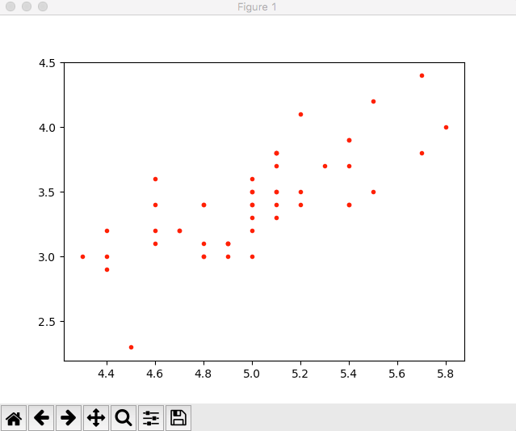
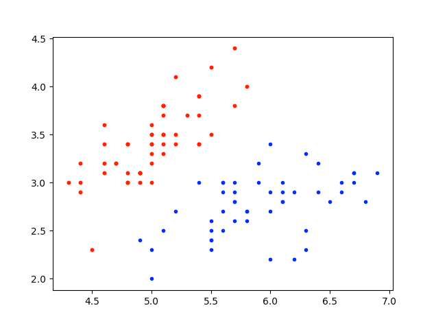
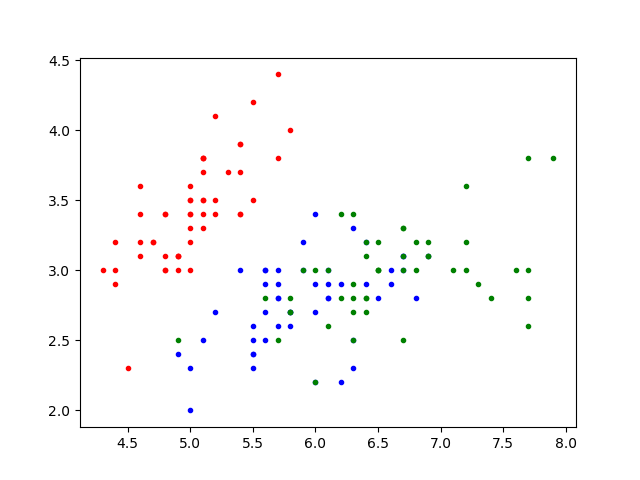
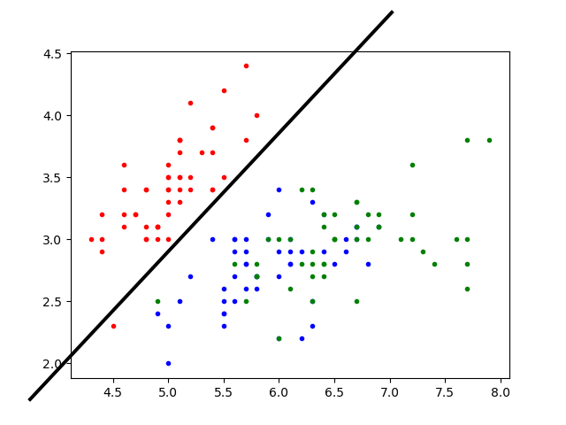
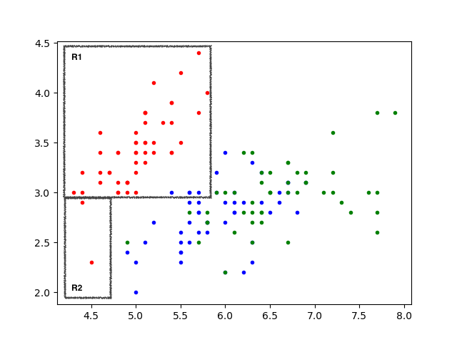
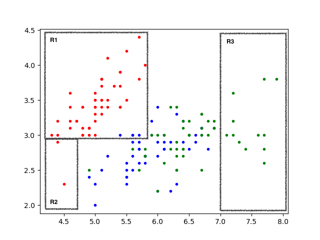

## Ejercicio Práctico ¿Setosa, Virginica o Versicolor?

#### Nota:
Para realizar los ejercicios debes tener previamente instalada la distribución [Anaconda](https://www.continuum.io/downloads) con python 2.7. En caso de que requieras ayuda en la instalación o alguna de las instrucciones, visita antes la sección [Python para Análisis de Datos].

Como primer ejercicio vamos a seguir el proceso de KDD para extraer conocimiento a partir del famoso [conjunto de datos de flores Iris](). El conjunto de datos incluso cuenta con su propia entrada en [wikipedia](https://es.wikipedia.org/wiki/Iris_flor_conjunto_de_datos). El conjunto de datos fue introducido por Ronald Fisher en un para un articulo en 1936. Contiene 50 muestras de tres especies de la flor Iris (Iris setosa, Iris virginica e Iris versicolor). Fisher midió cuatro características de cada muestra: el largo y ancho del sépalo y el largo y ancho del pétalo, en centímetros. Basado en la combinación de estos cuatro rasgos, Fisher se desarrolló un modelo discriminante lineal para distinguir entre una especie y otra. Como ejemplo veamos un fragmento que incluye varios registros de cada flor:

#### iris.data

```
sepal_length,sepal_width,petal_length,petal_width,species
5.1,3.5,1.4,0.2,setosa
4.9,3.0,1.4,0.2,setosa
4.7,3.2,1.3,0.2,setosa
4.6,3.1,1.5,0.2,setosa
7.0,3.2,4.7,1.4,versicolor
6.4,3.2,4.5,1.5,versicolor
6.9,3.1,4.9,1.5,versicolor
5.5,2.3,4.0,1.3,versicolor
6.5,2.8,4.6,1.5,versicolor
6.3,3.3,6.0,2.5,virginica
5.8,2.7,5.1,1.9,virginica
7.1,3.0,5.9,2.1,virginica
6.3,2.9,5.6,1.8,virginica
6.5,3.0,5.8,2.2,virginica
```
Para compartir los conjuntos de datos normalmente se utilizan archivos en formato texto. En este caso el *dataset* se encuentra en formato CSV ( comma-separated values) con el cual es muy fácil representar datos tabulares. Los archivos CSV se pueden abrir e importar sin ningún problema a hojas de calculo y sistemas de bases de datos. Como podemos ver en el ejemplo los registros están separados por saltos de línea, y en la primera se indica el nombre de la columna. En este caso cada registro cuenta con cinco campos. Los primeros cuatro son las lecturas correspondientes en centímetros y el último es muy importante ya que es la etiqueta o clase. En este caso en particular la etiqueta indica el tipo de flor.

### Paso 1: identificar el objetivo

El objetivo del proceso de KDD será encontrar algunos patrones que nos permitan clasificar las flores, o algún otro conocimiento nuevo.

### Paso 2: seleccionar y recolectar

En este caso lo que debemos hacer es simplemente bajarnos el archivo *iris.csv* de alguna parte. Esto lo podemos hacer manualmente o directamente con Python.

#### Recolectar archivo iris.data

Esto lo vamos a hacer de manera interactiva desde el interprete. Para ejecutar el interprete simplemente escribimos python en la línea de comandos.

El interprete nos da la bienvenida:

```
Python 2.7.13 |Anaconda custom (x86_64)| (default, Dec 20 2016, 23:05:08)
[GCC 4.2.1 Compatible Apple LLVM 6.0 (clang-600.0.57)] on darwin
Type "help", "copyright", "credits" or "license" for more information.
Anaconda is brought to you by Continuum Analytics.
Please check out: http://continuum.io/thanks and https://anaconda.org
>>>
```
El archivo lo podemos bajar del Machine Learning Repository de la UCI (University of California Irvine). La URL directa es la siguiente:
https://archive.ics.uci.edu/ml/machine-learning-databases/iris/iris.data. Me ha tocado algunas veces que no esta disponible el servidor, si esto sucede descárgalo de algún otro lado.

Para bajarlo utilizaremos la biblioteca de python [requests](http://docs.python-requests.org/en/master/). Esta biblioteca ya viene instalada en Anaconda. Solamente tenemos que importarla:

``` python
>>> import requests
```   
Hacemos la petición *get* al archivo (esto puede tardar unos segundos):

``` python
>>> r = requests.get('https://archive.ics.uci.edu/ml/machine-learning-databases/iris/iris.data')
```
Imprimimos el texto para ver que se haya bajado bien. Se debería ver esto:

``` python
>>> r.text
u'5.1,3.5,1.4,0.2,Iris-setosa\n4.9,3.0,1.4,0.2,Iris-setosa\n4.7,3.2,1.3,0.2,Iris-setosa\n4.6,3.1,1.5,0.2,Iris-setosa\n5.0,3.6,1.4,0.2,Iris-setosa\n5.4,3.9,1.7,0.4,Iris-setosa\n4.6,3.4,1.4,0.3,Iris-setosa\n5.0,3.4,1.5,0.2,Iris-setosa\n4.4,2.9,1.4,0.2,Iris-setosa\n4.9,3.1,1.5,0.1,Iris-setosa\n5.4,3.7,1.5,0.2,Iris-setosa\n4.8,3.4,1.6,0.2,Iris-setosa\n4.8,3.0,1.4,0.1,Iris-setosa\n4.3,3.0,1.1,0.1,Iris-setosa\n5.8,4.0,1.2,0.2,Iris-setosa\n5.7,4.4,1.5,0.4,Iris-setosa\n5.4,3.9,1.3,0.4,Iris-setosa\n5.1,3.5,1.4,0.3,Iris-setosa\n5.7,3.8,1.7,0.3,Iris-setosa\n5.1,3.8,1.5,0.3,Iris-setosa\n5.4,3.4,1.7,0.2,Iris-setosa\n5.1,3.7,1.5,0.4,Iris-setosa\n4.6,3.6,1.0,0.2,Iris-setosa\n5.1,3.3,1.7,0.5,Iris-setosa\n4.8,3.4,1.9,0.2,Iris-setosa\n5.0,3.0,1.6,0.2,Iris-setosa\n5.0,3.4,1.6,0.4,Iris-setosa\n5.2,3.5,1.5,0.2,Iris-setosa\n5.2,3.4,1.4,0.2,Iris-setosa\n4.7,3.2,1.6,0.2,Iris-setosa\n4.8,3.1,1.6,0.2,Iris-setosa\n5.4,3.4,1.5,0.4,Iris-setosa\n5.2,4.1,1.5,0.1,Iris-setosa\n5.5,4.2,1.4,0.2,Iris-setosa\n4.9,3.1,1.5,0.1,Iris-setosa\n5.0,3.2,1.2,0.2,Iris-setosa\n5.5,3.5,1.3,0.2,Iris-setosa\n4.9,3.1,1.5,0.1,Iris-setosa\n4.4,3.0,1.3,0.2,Iris-setosa\n5.1,3.4,1.5,0.2,Iris-setosa\n5.0,3.5,1.3,0.3,Iris-setosa\n4.5,2.3,1.3,0.3,Iris-setosa\n4.4,3.2,1.3,0.2,Iris-setosa\n5.0,3.5,1.6,0.6,Iris-setosa\n5.1,3.8,1.9,0.4,Iris-setosa\n4.8,3.0,1.4,0.3,Iris-setosa\n5.1,3.8,1.6,0.2,Iris-setosa\n4.6,3.2,1.4,0.2,Iris-setosa\n5.3,3.7,1.5,0.2,Iris-setosa\n5.0,3.3,1.4,0.2,Iris-setosa\n7.0,3.2,4.7,1.4,Iris-versicolor\n6.4,3.2,4.5,1.5,Iris-versicolor\n6.9,3.1,4.9,1.5,Iris-versicolor\n5.5,2.3,4.0,1.3,Iris-versicolor\n6.5,2.8,4.6,1.5,Iris-versicolor\n5.7,2.8,4.5,1.3,Iris-versicolor\n6.3,3.3,4.7,1.6,Iris-versicolor\n4.9,2.4,3.3,1.0,Iris-versicolor\n6.6,2.9,4.6,1.3,Iris-versicolor\n5.2,2.7,3.9,1.4,Iris-versicolor\n5.0,2.0,3.5,1.0,Iris-versicolor\n5.9,3.0,4.2,1.5,Iris-versicolor\n6.0,2.2,4.0,1.0,Iris-versicolor\n6.1,2.9,4.7,1.4,Iris-versicolor\n5.6,2.9,3.6,1.3,Iris-versicolor\n6.7,3.1,4.4,1.4,Iris-versicolor\n5.6,3.0,4.5,1.5,Iris-versicolor\n5.8,2.7,4.1,1.0,Iris-versicolor\n6.2,2.2,4.5,1.5,Iris-versicolor\n5.6,2.5,3.9,1.1,Iris-versicolor\n5.9,3.2,4.8,1.8,Iris-versicolor\n6.1,2.8,4.0,1.3,Iris-versicolor\n6.3,2.5,4.9,1.5,Iris-versicolor\n6.1,2.8,4.7,1.2,Iris-versicolor\n6.4,2.9,4.3,1.3,Iris-versicolor\n6.6,3.0,4.4,1.4,Iris-versicolor\n6.8,2.8,4.8,1.4,Iris-versicolor\n6.7,3.0,5.0,1.7,Iris-versicolor\n6.0,2.9,4.5,1.5,Iris-versicolor\n5.7,2.6,3.5,1.0,Iris-versicolor\n5.5,2.4,3.8,1.1,Iris-versicolor\n5.5,2.4,3.7,1.0,Iris-versicolor\n5.8,2.7,3.9,1.2,Iris-versicolor\n6.0,2.7,5.1,1.6,Iris-versicolor\n5.4,3.0,4.5,1.5,Iris-versicolor\n6.0,3.4,4.5,1.6,Iris-versicolor\n6.7,3.1,4.7,1.5,Iris-versicolor\n6.3,2.3,4.4,1.3,Iris-versicolor\n5.6,3.0,4.1,1.3,Iris-versicolor\n5.5,2.5,4.0,1.3,Iris-versicolor\n5.5,2.6,4.4,1.2,Iris-versicolor\n6.1,3.0,4.6,1.4,Iris-versicolor\n5.8,2.6,4.0,1.2,Iris-versicolor\n5.0,2.3,3.3,1.0,Iris-versicolor\n5.6,2.7,4.2,1.3,Iris-versicolor\n5.7,3.0,4.2,1.2,Iris-versicolor\n5.7,2.9,4.2,1.3,Iris-versicolor\n6.2,2.9,4.3,1.3,Iris-versicolor\n5.1,2.5,3.0,1.1,Iris-versicolor\n5.7,2.8,4.1,1.3,Iris-versicolor\n6.3,3.3,6.0,2.5,Iris-virginica\n5.8,2.7,5.1,1.9,Iris-virginica\n7.1,3.0,5.9,2.1,Iris-virginica\n6.3,2.9,5.6,1.8,Iris-virginica\n6.5,3.0,5.8,2.2,Iris-virginica\n7.6,3.0,6.6,2.1,Iris-virginica\n4.9,2.5,4.5,1.7,Iris-virginica\n7.3,2.9,6.3,1.8,Iris-virginica\n6.7,2.5,5.8,1.8,Iris-virginica\n7.2,3.6,6.1,2.5,Iris-virginica\n6.5,3.2,5.1,2.0,Iris-virginica\n6.4,2.7,5.3,1.9,Iris-virginica\n6.8,3.0,5.5,2.1,Iris-virginica\n5.7,2.5,5.0,2.0,Iris-virginica\n5.8,2.8,5.1,2.4,Iris-virginica\n6.4,3.2,5.3,2.3,Iris-virginica\n6.5,3.0,5.5,1.8,Iris-virginica\n7.7,3.8,6.7,2.2,Iris-virginica\n7.7,2.6,6.9,2.3,Iris-virginica\n6.0,2.2,5.0,1.5,Iris-virginica\n6.9,3.2,5.7,2.3,Iris-virginica\n5.6,2.8,4.9,2.0,Iris-virginica\n7.7,2.8,6.7,2.0,Iris-virginica\n6.3,2.7,4.9,1.8,Iris-virginica\n6.7,3.3,5.7,2.1,Iris-virginica\n7.2,3.2,6.0,1.8,Iris-virginica\n6.2,2.8,4.8,1.8,Iris-virginica\n6.1,3.0,4.9,1.8,Iris-virginica\n6.4,2.8,5.6,2.1,Iris-virginica\n7.2,3.0,5.8,1.6,Iris-virginica\n7.4,2.8,6.1,1.9,Iris-virginica\n7.9,3.8,6.4,2.0,Iris-virginica\n6.4,2.8,5.6,2.2,Iris-virginica\n6.3,2.8,5.1,1.5,Iris-virginica\n6.1,2.6,5.6,1.4,Iris-virginica\n7.7,3.0,6.1,2.3,Iris-virginica\n6.3,3.4,5.6,2.4,Iris-virginica\n6.4,3.1,5.5,1.8,Iris-virginica\n6.0,3.0,4.8,1.8,Iris-virginica\n6.9,3.1,5.4,2.1,Iris-virginica\n6.7,3.1,5.6,2.4,Iris-virginica\n6.9,3.1,5.1,2.3,Iris-virginica\n5.8,2.7,5.1,1.9,Iris-virginica\n6.8,3.2,5.9,2.3,Iris-virginica\n6.7,3.3,5.7,2.5,Iris-virginica\n6.7,3.0,5.2,2.3,Iris-virginica\n6.3,2.5,5.0,1.9,Iris-virginica\n6.5,3.0,5.2,2.0,Iris-virginica\n6.2,3.4,5.4,2.3,Iris-virginica\n5.9,3.0,5.1,1.8,Iris-virginica\n\n'
```
¡Muy bien!, a lo que sigue.

### Paso 3: Preprocesar los datos.

Una cadena enorme contiene todos los datos. Esto no nos sirven de mucho. El objetivo de este paso será procesar la cadena para tener como resultado un arreglo multidimensional de NumPy [QuickStart] (https://docs.scipy.org/doc/numpy-dev/user/quickstart.html). Este tipo de arreglos nos permite leer secciones a lo largo y ancho lo cual será muy útil en nuestro análisis. Más adelante veremos otras bibliotecas que simplificarán aun más este proceso como la biblioteca de análisis de datos [Pandas](http://pandas.pydata.org/).

Empezaremos por crear una lista a partir de una separación de la cadena. Esto lo hacemos con el método split() separando la cadena por los saltos de línea ('\n'):

``` python
>>> renglones_iris = r.text.split('\n')
```

Revisemos un poco el contenido de la lista:

``` python
>>> renglones_iris[:5]
[u'5.1,3.5,1.4,0.2,Iris-setosa', u'4.9,3.0,1.4,0.2,Iris-setosa', u'4.7,3.2,1.3,0.2,Iris-setosa', u'4.6,3.1,1.5,0.2,Iris-setosa', u'5.0,3.6,1.4,0.2,Iris-setosa']
```
Podemos ver un detalle importante al final de la lista: los últimos dos renglones están vacíos:
``` python
>>> renglones_iris[-4:]
[u'6.2,3.4,5.4,2.3,Iris-virginica', u'5.9,3.0,5.1,1.8,Iris-virginica', u'', u'']
```
Observamos también que cada uno de los elementos de la lista a su vez está separado por comas y no necesitamos el último dato ya que queremos solo las medidas en centímetros. Lo que queremos entonces es crear una nueva lista a partir de renglones_iris que tenga como elementos a su vez listas con las medidas. Para esto utilizaremos [comprensión de listas](). Primero vamos a hacer algunas pruebas:
```python
>>> [ renglon.split(',')[:-1] for renglon in renglones_iris[:-2]]
[[u'5.1', u'3.5', u'1.4', u'0.2'], [u'4.9', u'3.0', u'1.4', u'0.2'], [u'4.7', u'3.2', u'1.3', u'0.2'], [u'4.6', u'3.1', u'1.5', u'0.2'], [u'5.0', u'3.6', u'1.4', u'0.2'], [u'5.4', u'3.9', u'1.7', u'0.4'], [u'4.6', u'3.4', u'1.4', u'0.3'], [u'5.0', u'3.4', u'1.5', u'0.2'], [u'4.4', u'2.9', u'1.4', u'0.2'], [u'4.9', u'3.1', u'1.5', u'0.1'], [u'5.4', u'3.7', u'1.5', u'0.2'], [u'4.8', u'3.4', u'1.6', u'0.2'], [u'4.8', u'3.0', u'1.4', u'0.1'], [u'4.3', u'3.0', u'1.1', u'0.1'], [u'5.8', u'4.0', u'1.2', u'0.2'], [u'5.7', u'4.4', u'1.5', u'0.4'], [u'5.4', u'3.9', u'1.3', u'0.4'], [u'5.1', u'3.5', u'1.4', u'0.3'], [u'5.7', u'3.8', u'1.7', u'0.3'], [u'5.1', u'3.8', u'1.5', u'0.3'], [u'5.4', u'3.4', u'1.7', u'0.2'], [u'5.1', u'3.7', u'1.5', u'0.4'], [u'4.6', u'3.6', u'1.0', u'0.2'], [u'5.1', u'3.3', u'1.7', u'0.5'], [u'4.8', u'3.4', u'1.9', u'0.2'], [u'5.0', u'3.0', u'1.6', u'0.2'], [u'5.0', u'3.4', u'1.6', u'0.4'], [u'5.2', u'3.5', u'1.5', u'0.2'], [u'5.2', u'3.4', u'1.4', u'0.2'], [u'4.7', u'3.2', u'1.6', u'0.2'], [u'4.8', u'3.1', u'1.6', u'0.2'], [u'5.4', u'3.4', u'1.5', u'0.4'], [u'5.2', u'4.1', u'1.5', u'0.1'], [u'5.5', u'4.2', u'1.4', u'0.2'], [u'4.9', u'3.1', u'1.5', u'0.1'], [u'5.0', u'3.2', u'1.2', u'0.2'], [u'5.5', u'3.5', u'1.3', u'0.2'], [u'4.9', u'3.1', u'1.5', u'0.1'], [u'4.4', u'3.0', u'1.3', u'0.2'], [u'5.1', u'3.4', u'1.5', u'0.2'], [u'5.0', u'3.5', u'1.3', u'0.3'], [u'4.5', u'2.3', u'1.3', u'0.3'], [u'4.4', u'3.2', u'1.3', u'0.2'], [u'5.0', u'3.5', u'1.6', u'0.6'], [u'5.1', u'3.8', u'1.9', u'0.4'], [u'4.8', u'3.0', u'1.4', u'0.3'], [u'5.1', u'3.8', u'1.6', u'0.2'], [u'4.6', u'3.2', u'1.4', u'0.2'], [u'5.3', u'3.7', u'1.5', u'0.2'], [u'5.0', u'3.3', u'1.4', u'0.2'], [u'7.0', u'3.2', u'4.7', u'1.4'], [u'6.4', u'3.2', u'4.5', u'1.5'], [u'6.9', u'3.1', u'4.9', u'1.5'], [u'5.5', u'2.3', u'4.0', u'1.3'], [u'6.5', u'2.8', u'4.6', u'1.5'], [u'5.7', u'2.8', u'4.5', u'1.3'], [u'6.3', u'3.3', u'4.7', u'1.6'], [u'4.9', u'2.4', u'3.3', u'1.0'], [u'6.6', u'2.9', u'4.6', u'1.3'], [u'5.2', u'2.7', u'3.9', u'1.4'], [u'5.0', u'2.0', u'3.5', u'1.0'], [u'5.9', u'3.0', u'4.2', u'1.5'], [u'6.0', u'2.2', u'4.0', u'1.0'], [u'6.1', u'2.9', u'4.7', u'1.4'], [u'5.6', u'2.9', u'3.6', u'1.3'], [u'6.7', u'3.1', u'4.4', u'1.4'], [u'5.6', u'3.0', u'4.5', u'1.5'], [u'5.8', u'2.7', u'4.1', u'1.0'], [u'6.2', u'2.2', u'4.5', u'1.5'], [u'5.6', u'2.5', u'3.9', u'1.1'], [u'5.9', u'3.2', u'4.8', u'1.8'], [u'6.1', u'2.8', u'4.0', u'1.3'], [u'6.3', u'2.5', u'4.9', u'1.5'], [u'6.1', u'2.8', u'4.7', u'1.2'], [u'6.4', u'2.9', u'4.3', u'1.3'], [u'6.6', u'3.0', u'4.4', u'1.4'], [u'6.8', u'2.8', u'4.8', u'1.4'], [u'6.7', u'3.0', u'5.0', u'1.7'], [u'6.0', u'2.9', u'4.5', u'1.5'], [u'5.7', u'2.6', u'3.5', u'1.0'], [u'5.5', u'2.4', u'3.8', u'1.1'], [u'5.5', u'2.4', u'3.7', u'1.0'], [u'5.8', u'2.7', u'3.9', u'1.2'], [u'6.0', u'2.7', u'5.1', u'1.6'], [u'5.4', u'3.0', u'4.5', u'1.5'], [u'6.0', u'3.4', u'4.5', u'1.6'], [u'6.7', u'3.1', u'4.7', u'1.5'], [u'6.3', u'2.3', u'4.4', u'1.3'], [u'5.6', u'3.0', u'4.1', u'1.3'], [u'5.5', u'2.5', u'4.0', u'1.3'], [u'5.5', u'2.6', u'4.4', u'1.2'], [u'6.1', u'3.0', u'4.6', u'1.4'], [u'5.8', u'2.6', u'4.0', u'1.2'], [u'5.0', u'2.3', u'3.3', u'1.0'], [u'5.6', u'2.7', u'4.2', u'1.3'], [u'5.7', u'3.0', u'4.2', u'1.2'], [u'5.7', u'2.9', u'4.2', u'1.3'], [u'6.2', u'2.9', u'4.3', u'1.3'], [u'5.1', u'2.5', u'3.0', u'1.1'], [u'5.7', u'2.8', u'4.1', u'1.3'], [u'6.3', u'3.3', u'6.0', u'2.5'], [u'5.8', u'2.7', u'5.1', u'1.9'], [u'7.1', u'3.0', u'5.9', u'2.1'], [u'6.3', u'2.9', u'5.6', u'1.8'], [u'6.5', u'3.0', u'5.8', u'2.2'], [u'7.6', u'3.0', u'6.6', u'2.1'], [u'4.9', u'2.5', u'4.5', u'1.7'], [u'7.3', u'2.9', u'6.3', u'1.8'], [u'6.7', u'2.5', u'5.8', u'1.8'], [u'7.2', u'3.6', u'6.1', u'2.5'], [u'6.5', u'3.2', u'5.1', u'2.0'], [u'6.4', u'2.7', u'5.3', u'1.9'], [u'6.8', u'3.0', u'5.5', u'2.1'], [u'5.7', u'2.5', u'5.0', u'2.0'], [u'5.8', u'2.8', u'5.1', u'2.4'], [u'6.4', u'3.2', u'5.3', u'2.3'], [u'6.5', u'3.0', u'5.5', u'1.8'], [u'7.7', u'3.8', u'6.7', u'2.2'], [u'7.7', u'2.6', u'6.9', u'2.3'], [u'6.0', u'2.2', u'5.0', u'1.5'], [u'6.9', u'3.2', u'5.7', u'2.3'], [u'5.6', u'2.8', u'4.9', u'2.0'], [u'7.7', u'2.8', u'6.7', u'2.0'], [u'6.3', u'2.7', u'4.9', u'1.8'], [u'6.7', u'3.3', u'5.7', u'2.1'], [u'7.2', u'3.2', u'6.0', u'1.8'], [u'6.2', u'2.8', u'4.8', u'1.8'], [u'6.1', u'3.0', u'4.9', u'1.8'], [u'6.4', u'2.8', u'5.6', u'2.1'], [u'7.2', u'3.0', u'5.8', u'1.6'], [u'7.4', u'2.8', u'6.1', u'1.9'], [u'7.9', u'3.8', u'6.4', u'2.0'], [u'6.4', u'2.8', u'5.6', u'2.2'], [u'6.3', u'2.8', u'5.1', u'1.5'], [u'6.1', u'2.6', u'5.6', u'1.4'], [u'7.7', u'3.0', u'6.1', u'2.3'], [u'6.3', u'3.4', u'5.6', u'2.4'], [u'6.4', u'3.1', u'5.5', u'1.8'], [u'6.0', u'3.0', u'4.8', u'1.8'], [u'6.9', u'3.1', u'5.4', u'2.1'], [u'6.7', u'3.1', u'5.6', u'2.4'], [u'6.9', u'3.1', u'5.1', u'2.3'], [u'5.8', u'2.7', u'5.1', u'1.9'], [u'6.8', u'3.2', u'5.9', u'2.3'], [u'6.7', u'3.3', u'5.7', u'2.5'], [u'6.7', u'3.0', u'5.2', u'2.3'], [u'6.3', u'2.5', u'5.0', u'1.9'], [u'6.5', u'3.0', u'5.2', u'2.0'], [u'6.2', u'3.4', u'5.4', u'2.3'], [u'5.9', u'3.0', u'5.1', u'1.8']]
```

Lo que estamos haciendo es lo siguiente: a partir de la lista renglones_iris menos sus últimos dos elementos (renglones_iris[:-2]) vamos a generar una lista nueva procesando cada uno de sus elementos. Cada una de las cadenas en renglones_iris la vamos a separar por las comas y nos quedaremos con los primeros cuatro elementos (renglon.split(',')[:-1]).  Ya casi tenemos lo que necesitamos. Solamente faltaría convertir cada elemento a tipo flotante ya que como vemos son todas cadenas. Esto lo podemos hacer utilizando la función map() la cual aplica una función a cada elemento de la lista regresando una nueva. En este caso queremos utilizar la función float(). Veamos:

```python
>>> [map(float, renglon.split(',')[:-1]) for renglon in   renglones_iris[:-2]]
[[5.1, 3.5, 1.4, 0.2], [4.9, 3.0, 1.4, 0.2], [4.7, 3.2, 1.3, 0.2], [4.6, 3.1, 1.5, 0.2], [5.0, 3.6, 1.4, 0.2], [5.4, 3.9, 1.7, 0.4], [4.6, 3.4, 1.4, 0.3], [5.0, 3.4, 1.5, 0.2], [4.4, 2.9, 1.4, 0.2], [4.9, 3.1, 1.5, 0.1], [5.4, 3.7, 1.5, 0.2], [4.8, 3.4, 1.6, 0.2], [4.8, 3.0, 1.4, 0.1], [4.3, 3.0, 1.1, 0.1], [5.8, 4.0, 1.2, 0.2], [5.7, 4.4, 1.5, 0.4], [5.4, 3.9, 1.3, 0.4], [5.1, 3.5, 1.4, 0.3], [5.7, 3.8, 1.7, 0.3], [5.1, 3.8, 1.5, 0.3], [5.4, 3.4, 1.7, 0.2], [5.1, 3.7, 1.5, 0.4], [4.6, 3.6, 1.0, 0.2], [5.1, 3.3, 1.7, 0.5], [4.8, 3.4, 1.9, 0.2], [5.0, 3.0, 1.6, 0.2], [5.0, 3.4, 1.6, 0.4], [5.2, 3.5, 1.5, 0.2], [5.2, 3.4, 1.4, 0.2], [4.7, 3.2, 1.6, 0.2], [4.8, 3.1, 1.6, 0.2], [5.4, 3.4, 1.5, 0.4], [5.2, 4.1, 1.5, 0.1], [5.5, 4.2, 1.4, 0.2], [4.9, 3.1, 1.5, 0.1], [5.0, 3.2, 1.2, 0.2], [5.5, 3.5, 1.3, 0.2], [4.9, 3.1, 1.5, 0.1], [4.4, 3.0, 1.3, 0.2], [5.1, 3.4, 1.5, 0.2], [5.0, 3.5, 1.3, 0.3], [4.5, 2.3, 1.3, 0.3], [4.4, 3.2, 1.3, 0.2], [5.0, 3.5, 1.6, 0.6], [5.1, 3.8, 1.9, 0.4], [4.8, 3.0, 1.4, 0.3], [5.1, 3.8, 1.6, 0.2], [4.6, 3.2, 1.4, 0.2], [5.3, 3.7, 1.5, 0.2], [5.0, 3.3, 1.4, 0.2], [7.0, 3.2, 4.7, 1.4], [6.4, 3.2, 4.5, 1.5], [6.9, 3.1, 4.9, 1.5], [5.5, 2.3, 4.0, 1.3], [6.5, 2.8, 4.6, 1.5], [5.7, 2.8, 4.5, 1.3], [6.3, 3.3, 4.7, 1.6], [4.9, 2.4, 3.3, 1.0], [6.6, 2.9, 4.6, 1.3], [5.2, 2.7, 3.9, 1.4], [5.0, 2.0, 3.5, 1.0], [5.9, 3.0, 4.2, 1.5], [6.0, 2.2, 4.0, 1.0], [6.1, 2.9, 4.7, 1.4], [5.6, 2.9, 3.6, 1.3], [6.7, 3.1, 4.4, 1.4], [5.6, 3.0, 4.5, 1.5], [5.8, 2.7, 4.1, 1.0], [6.2, 2.2, 4.5, 1.5], [5.6, 2.5, 3.9, 1.1], [5.9, 3.2, 4.8, 1.8], [6.1, 2.8, 4.0, 1.3], [6.3, 2.5, 4.9, 1.5], [6.1, 2.8, 4.7, 1.2], [6.4, 2.9, 4.3, 1.3], [6.6, 3.0, 4.4, 1.4], [6.8, 2.8, 4.8, 1.4], [6.7, 3.0, 5.0, 1.7], [6.0, 2.9, 4.5, 1.5], [5.7, 2.6, 3.5, 1.0], [5.5, 2.4, 3.8, 1.1], [5.5, 2.4, 3.7, 1.0], [5.8, 2.7, 3.9, 1.2], [6.0, 2.7, 5.1, 1.6], [5.4, 3.0, 4.5, 1.5], [6.0, 3.4, 4.5, 1.6], [6.7, 3.1, 4.7, 1.5], [6.3, 2.3, 4.4, 1.3], [5.6, 3.0, 4.1, 1.3], [5.5, 2.5, 4.0, 1.3], [5.5, 2.6, 4.4, 1.2], [6.1, 3.0, 4.6, 1.4], [5.8, 2.6, 4.0, 1.2], [5.0, 2.3, 3.3, 1.0], [5.6, 2.7, 4.2, 1.3], [5.7, 3.0, 4.2, 1.2], [5.7, 2.9, 4.2, 1.3], [6.2, 2.9, 4.3, 1.3], [5.1, 2.5, 3.0, 1.1], [5.7, 2.8, 4.1, 1.3], [6.3, 3.3, 6.0, 2.5], [5.8, 2.7, 5.1, 1.9], [7.1, 3.0, 5.9, 2.1], [6.3, 2.9, 5.6, 1.8], [6.5, 3.0, 5.8, 2.2], [7.6, 3.0, 6.6, 2.1], [4.9, 2.5, 4.5, 1.7], [7.3, 2.9, 6.3, 1.8], [6.7, 2.5, 5.8, 1.8], [7.2, 3.6, 6.1, 2.5], [6.5, 3.2, 5.1, 2.0], [6.4, 2.7, 5.3, 1.9], [6.8, 3.0, 5.5, 2.1], [5.7, 2.5, 5.0, 2.0], [5.8, 2.8, 5.1, 2.4], [6.4, 3.2, 5.3, 2.3], [6.5, 3.0, 5.5, 1.8], [7.7, 3.8, 6.7, 2.2], [7.7, 2.6, 6.9, 2.3], [6.0, 2.2, 5.0, 1.5], [6.9, 3.2, 5.7, 2.3], [5.6, 2.8, 4.9, 2.0], [7.7, 2.8, 6.7, 2.0], [6.3, 2.7, 4.9, 1.8], [6.7, 3.3, 5.7, 2.1], [7.2, 3.2, 6.0, 1.8], [6.2, 2.8, 4.8, 1.8], [6.1, 3.0, 4.9, 1.8], [6.4, 2.8, 5.6, 2.1], [7.2, 3.0, 5.8, 1.6], [7.4, 2.8, 6.1, 1.9], [7.9, 3.8, 6.4, 2.0], [6.4, 2.8, 5.6, 2.2], [6.3, 2.8, 5.1, 1.5], [6.1, 2.6, 5.6, 1.4], [7.7, 3.0, 6.1, 2.3], [6.3, 3.4, 5.6, 2.4], [6.4, 3.1, 5.5, 1.8], [6.0, 3.0, 4.8, 1.8], [6.9, 3.1, 5.4, 2.1], [6.7, 3.1, 5.6, 2.4], [6.9, 3.1, 5.1, 2.3], [5.8, 2.7, 5.1, 1.9], [6.8, 3.2, 5.9, 2.3], [6.7, 3.3, 5.7, 2.5], [6.7, 3.0, 5.2, 2.3], [6.3, 2.5, 5.0, 1.9], [6.5, 3.0, 5.2, 2.0], [6.2, 3.4, 5.4, 2.3], [5.9, 3.0, 5.1, 1.8]]
```

Ya que obtuvimos el código paso a paso, vamos a utilizarlo para crear el nuevo arreglo:

```python
>>> import numpy
>>> iris_data = [map(float, renglon.split(',')[:-1]) for renglon in   renglones_iris[:-2]]
>>> iris = numpy.array(iris_data)
```
Listo ya tenemos nuestros datos en una estructura adecuada:
```python
>>> iris[:10]
array([[ 5.1,  3.5,  1.4,  0.2],
       [ 4.9,  3. ,  1.4,  0.2],
       [ 4.7,  3.2,  1.3,  0.2],
       [ 4.6,  3.1,  1.5,  0.2],
       [ 5. ,  3.6,  1.4,  0.2],
       [ 5.4,  3.9,  1.7,  0.4],
       [ 4.6,  3.4,  1.4,  0.3],
       [ 5. ,  3.4,  1.5,  0.2],
       [ 4.4,  2.9,  1.4,  0.2],
       [ 4.9,  3.1,  1.5,  0.1]])
```
### Paso 4: Transformar los datos
En este caso sencillo no será necesario transformar los datos.

### Paso 5:  Seleccionar la tarea de minería de datos
La tarea que vamos a realizar será *Clasificación*.

### Paso 6:  Análisis exploratorio
La minería de datos en este primer ejercicio la vamos a realizar manualmente, para esto vamos a explorar los datos visualmente. Para ello utilizaremos la popular biblioteca [matplotlib](https://matplotlib.org/). Primero vamos a seleccionar las dos primeras características: ancho y largo del sépalo para ver si hay algún patrón útil. Importamos matplotlib y hacemos el plot de la primera flor. Los primeros cincuenta datos son de Iris Setosa:   

```python
>>> import matplotlib.pyplot as plt
>>> x = iris[:50,0]
>>> y = iris[:50,1]
>>> plt.plot(x, y, 'r.')
>>> plt.show()
```

Al ejecutar la instrucción plt.show() se debería mostrar lo siguiente:



En el eje **x** tenemos el ancho del sépalo Y en el eje **y** el largo, ambos en cm. El parámetro 'r.' indica que las flores Setosa se representarán por puntos rojos ('r.' red dots).

Ahora graficaremos al mismo tiempo las flores Setosa y Versicolor:

```python
>>> plt.plot( iris[:50,0], iris[:50,1], 'r.') # Setosa
[<matplotlib.lines.Line2D object at 0x1066ed610>]
>>> plt.plot( iris[51:100,0], iris[51:100,1], 'b.')
[<matplotlib.lines.Line2D object at 0x113731710>] # Virginica
>>> plt.show()
```
Descubrimos algo, es posible separar linealmente o clasificar ambas flores utilizando estas dos características:


```python
>>> plt.plot( iris[51:100,0], iris[51:100,1], 'b.')
[<matplotlib.lines.Line2D object at 0x114cae950>]
>>> plt.plot( iris[101:,0], iris[101:,1], 'g.')
[<matplotlib.lines.Line2D object at 0x114cbc110>]
>>> plt.show()
```
Veremos si corremos con igual suerte al agregar la Versicolor:

```python
[<matplotlib.lines.Line2D object at 0x114cae850>]
>>> plt.plot( iris[51:100,0], iris[51:100,1], 'b.')
[<matplotlib.lines.Line2D object at 0x114cae950>]
>>> plt.plot( iris[101:,0], iris[101:,1], 'g.')
[<matplotlib.lines.Line2D object at 0x114cbc110>]
>>> plt.show()
```



Por lo menos al considerar estas dos características vemos que es difícil distinguir entre las flores Virginica y Versicorlor.

### Paso 7:  Minería de Datos

Este paso lo vamos a hacer manualmente por lo pronto. ¿Como podríamos especificar el modelo?. Una manera muy sencilla sería la siguiente:



Utilizando una recta para separar a las flores Setosa del resto. Podríamos además utilizar varias rectas o incluso funciones no lineales. Estas ideas las podremos llevar acabo "manualmente" ya que solo estamos considerando dos características. Esto se puede tornar más difícil al considerar las otras dos medidas pues estaríamos trabajando en dimensión cuatro.

Otra modelo podría ser expresado en forma de reglas:
```
R1:
    SI sepal_length < 5.9 AND sepal_width > 2.9
    ENTONCES:
         Setosa

R2:
    SI sepal_length < 4.7 AND sepal_width <= 2.9
    ENTONCES:
         Setosa
```

Gráficamente sería algo como:



Ya que estamos en esto podemos proponer un nuevo modelo simplemente agregando otra regla:


Podríamos segur buscando, por ejemplo cambiando un poco los antecedentes de las reglas, por ejemplo de sepal_length < 5.9 a sepal_length < 6.0. Nos empezamos a dar cuenta que no es fácil hacer esto manualmente. Mejor hagamos programas que hagan este trabajo de generar modelos automáticamente. Es decir, algoritmos de aprendizaje automático.

### Paso 8. Interpretar y evaluar

Esto lo haremos más adelante, pero vale la pena pensar un poco al respecto. ¿Cual es mejor modelo?, ¿El mejor es suficientemente bueno?, ¿Existe un modelo óptimo?. ¿Que pasará cuando agreguemos nuevas flores al conjunto de datos?.
También debemos pensar si pudimos extraer algún conocimiento nuevo. ¿Es útil?.

### Paso 9. Aplicar el conocimiento adquirido

De este pequeño ejercicio podríamos reportar que las flores Setosa son fáciles de identificar.  

Este ejercicio es básico y además no hicimos todas las consideraciones. Más adelante veremos otros detalles que no hemos considerado y por supuesto ya no haremos la minería de datos manualmente. El ejercicio también ha servido para darnos idea de como trabajaremos con Python y sus bibliotecas para este tipo de tareas. Seguro te diste cuenta que no hemos utilizado ciclos, enviamos funciones como parámetros y trabajamos de forma interactiva para llegar a la solución.

#### Atención estudiantes:
Si te fijas el proceso de KDD también puede ser utilizado como guía para hacer  proyectos de investigación en el área. El proceso es el mismo pero cambian los algoritmos, aplicaciones y tipos de datos.
