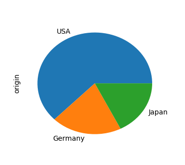
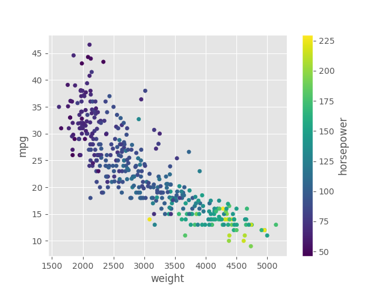

# Pandas

El análisis de datos comúnmente se realiza sobre datos que se encuentran organizados en forma de tablas. Probablemente ya haz utilizado datos organizados de esta manera al utilizar una hoja de cálculo o tablas en servidores de bases de datos relacionales como Oracle, PostgreSQL o SQLServer. En python incluso podemos almacenar los datos de una tabla utilizando un arreglo de tuplas.

## Otras opciones

### ¿Por que no utilizamos tablas de SQL?
Los sistemas de bases de datos tienen como objetivo almacenar grandes cantidades
de datos y al mismo tiempo nos permiten realizar un gran número de transacciones
de manera concurrente. Dicho de otra manera los servidores nos permiten realizar
la parte operativa de una empresa, vender boletos para conciertos, inscribir
alumnos, llevar el control de un almacén, procesar los pedidos en una tienda en
línea, etc. Además de esto cuentan con un lenguaje de alto nivel para definir,
manipular y consultar a los datos. El lenguaje estándar SQL ha sido el preferido
por los desarrolladores para consultar de una manera muy flexible a los datos
relacionales. El problema que tenemos en estos sistemas es que su objetivo
principal no es el analizar los datos, estos sistemas nos permiten más bien
implementar sistemas que necesitan manipular datos en-línea para funcionar. Por
otro lado, para hacer nuestro análisis, podemos utilizar perfectamente datos que
estén fuera de línea, datos históricos o incluso datos ficticios. Mucho del
*overhead* de un servidor de bases de datos se tiene precisamente por que estos
deben ser capaces de modificar las estructuras de las tablas, hacer
modificaciones a objetos, mantener la consistencia, controlar el acceso y muchas
otras operaciones. Todo en línea. Al no tener estos requisitos podemos operar
con estructuras diseñadas precisamente para el análisis de datos.  Dicho esto,
algunos sistemas de bases de datos han agregado la funcionalidad necesaria para
realizar el tipo de análisis que veremos, pero esto no es todavía el estándar.
Los sistemas de bases de datos nos pueden servir para almacenar los datos que
utilizaremos en el análisis y realizar algunas consultas con SQL. Podemos
utilizar también la biblioteca SQLite para almacenar bitácoras, intercambiar
información con otros sistemas o como parte del preprocesamiento.

### ¿Por que no utilizamos NoSQL?
Últimamente se han propuesto gestores de datos que aunque no siguen el modelo
relacional nos permiten hacer cierto tipo de consultas de una manera mucho más
eficiente. Por ejemplo, los almacenes clave-valor (key-value) pueden recuperar
bastante rápido los datos por medio de su clave; pero el lenguaje de consulta,
si es que lo hay, no es muy flexible. Son muy buenos para recuperar muy rápido
un documento html o un objeto con solo especificar su clave, pero no podemos
hacer consultas *ad-hoc* como "recupera aquellos productos que tengan ventas
superiores al promedio en las tiendas de California o Arizona, siempre que no
sean del departamento de electrónica". Estos sistemas nos pueden servir sobre
todo como memoria cache o memoria compartida para realizar operaciones en
paralelo.

### ¿Por que no utilizamos Data Warehouse?
Las técnicas de Almacenes de Datos (Data Warehouse) nos permiten realizar de una
manera muy sencilla consultas *tipo cubo* sobre bases de datos relacionales.
Aunque las consultas permiten a los ejecutivos tomar decisiones y tener una
buena idea de lo que sucede en la empresa, su objetivo no es el de extraer
patrones de los datos. Sin embargo el objetivo general y el diseño de los
Almacenes de Datos tiene algunas cosas en común con el proceso de KDD. Ambos
trabajan con datos históricos y requieren de un proceso previo de extracción de
los datos al cual se le conoce como ETL (Extract, Transform and Load) o
Extraer, Transformar y Cargar). El proceso de ETL permite a las empresas extraer
datos desde diferentes fuentes, cambiar de formato  y limpiarlos con el objetivo
de  cargarlos en el almacén de datos.

### ¿Por que no utilizamos Hoja de Cálculo?
De hecho las hojas de cálculo son una herramienta aceptable para realizar
análisis de datos. Muchos analistas utilizan hojas de calculo como herramienta
principal. No se requiere tener un amplío conocimiento de programación para
sacarles provecho y pueden complementares con otras herramientas por ejemplo con
sistemas de bases de datos. Los programadores normalmente preferimos tener un
control total sobre el proceso de KDD y nos gusta poder integrar fácilmente
nuestro código en distintas aplicaciones, por lo que preferimos la flexibilidad
que nos brinda un lenguaje de propósito general.

# Breve Introducción al DataFrame de Pandas

Pandas es una biblioteca código abierto en Python la cual se ha diseñado con el objetivo específico de brindarnos una estructura de tabla rápida y flexible para el análisis de datos. Según
su [documentación](http://pandas.pydata.org/pandas-docs/stable/)
pandas nos permite operar con distintos tipos de datos:

* Tablas con atributos heterogéneos.
* Series de tiempo, ordenadas o no.
* Matrices homogéneas o heterogéneas.

Para esto en pandas se implementan dos estructuras principales: *Series* y *DataFrame*. La estructura *Series* nos permite trabajar con datos de series de tiempo especificadas como un vector. Por otro lado está *DataFrame* nos sirve para aquellos datos que tienen una estructura de tabla o matriz. En esta sección nos enfocaremos en la estructura *DataFrame* ya que nos interesa trabajar con datos organizados como tabla.

## Creando un DataFrame desde un archivo de texto
Como ejemplo, vamos a utilizar una estructura tipo DataFrame para almacenar el conjunto de
datos conocido como [Auto
MPG](https://archive.ics.uci.edu/ml/datasets/Auto+MPG). Lo primero que debemos  hacer es ver los tipos de datos de los atributos:

|  nombre        | tipo     | medida     |  descripción             |
|----------------|----------| -----------|--------------------------|
|  mpg           | continuo | razón      | millas por galón         |
|  cylinders     | discreto | ordinal    | número de cilindros      |
|  displacement  | continuo | razón      | desplazamiento           |
|  horsepower    | continuo | razón      | caballos de fuerza       |
|  weight        | continuo | razón      | peso en libras US        |
|  acceleration  | continuo | razón      | aceleración              |
|  model_year    | discreto | razón      | año de fabricación       |
|  origin        | discreto | categórico | origen                   |
|  car_name      | cadena   | categórico | nombre único del auto    |

Como vemos estas observaciones tienen atributos heterogéneos ya que son de distintos tipos. El objetivo original de este conjunto de datos era el de predecir el consumo de combustible en millas por galón (mpg) utilizando los otros atributos.

Como siguiente paso vamos a descargar el conjunto de datos del [repositorio de
machine learning de la
UC-Irvine](https://archive.ics.uci.edu/ml/machine-learning-databases/auto-mpg/).
El archivo se llama **auto-mpg.data**. Al abrir el archivo en un editor de texto
vemos que está separado por espacios y faltan algunos valores. Veamos un
fragmento:

```
11.0   8   350.0      180.0      3664.      11.0   73  1	"oldsmobile omega"
20.0   6   198.0      95.00      3102.      16.5   74  1	"plymouth duster"
21.0   6   200.0      ?          2875.      17.0   74  1	"ford maverick"
```

Pandas nos brinda *IO Tools* un API de entrada/salida donde se incluyen métodos
de lectura para formatos de texto, binarios y SQL. En el caso de text se
incluyen lectores para formatos CSV, JSON y HTML. Vamos a intentar leer el
archivo utilizando el método *read_csv()* para más detalle puedes ver la
[documentación](http://pandas.pydata.org/pandas-docs/stable/io.html#io-read-csv-table).
La manera en la que se lee y se hace el "parsing" a los archivos se puede configurar de una manera muy detallada, para este ejemplo solo modificaremos algunos parámetros básicos. Recordemos que en los archivos CSV, como el nombre lo dice, los valores de los atributos se separan por comas. Ya vimos que en el  caso del archivo **auto-mpg.data**  la separación se hace por medio de espacios en blanco. Un problema adicional es que el número de espacios no siempre es el mismo. Para leer el archivo correctamente, vamos a utilizar el parámetro *sep* el cual recibe una especificación del separador que se va a utilizar, por defecto una coma ','. En nuestro caso el separador será una expresión regular la cual le diga al método que son uno o más espacios. El espacio en la expresión regular se especifica con la cadena '/s', mientras que el operador '+' indica que se puede repetir una o más veces. Nuestro primer intento quedaría de la siguiente manera:    

``` python
>>> df1 = pd.read_csv('datos-ejemplo/auto-mpg.data', sep='/s+')

```

Si ejecutamos la instrucción veremos que efectivamente se tiene una tabla con
nueve columnas, pero sin nombre de atributos. El lector espera que el primer
renglón tenga el nombre de los atributos. Podemos especificar que no se incluye
este renglón con el argumento *header=None* En este caso el nombre de los
atributos será un indice.
``` python
>>> df2 = pd.read_csv('datos-ejemplo/auto-mpg.data', sep='\s+', header=None)
>>> df2
```
Mejor aún especifiquemos los nombres de los atributos:
``` python
>>> df2 = pd.read_csv('datos-ejemplo/auto-mpg.data', sep='\s+', header=None, names=['mpg','cylinders','displacement','horsepower','weight','acceleration','model_year','origin','car_name'])
>>> df2
```
Mucho mejor, veamos que tipo de datos infirió el método para cada una de las columnas:

``` python
>>> df2.dtypes
mpg             float64
cylinders         int64
displacement    float64
horsepower       object
weight          float64
acceleration    float64
model_year        int64
origin            int64
car_name         object
dtype: object
```
Hay un problema con el atributo *horsepower* este debería de ser float64. Lo que
sucede es que al leer el carácter *?* el método de lectura no sabe que tipo de
dato inferir. Lo bueno es que podemos configurar como queremos que se resuelvan
los casos donde tenemos datos no disponibles y también como se indica cuando
tenemos valores de este tipo. El argumento es *na_values*, podemos indicar una
lista de valores o como en este caso simplemente el símbolo correspondiente.

``` python
df2 = pd.read_csv('datos-ejemplo/auto-mpg.data', sep='\s+', header=None, names=['mpg','cylinders','displacement','horsepower','weight','acceleration','model_year','origin','car_name'], na_values='?')

>>> df2.dtypes
mpg             float64
cylinders         int64
displacement    float64
horsepower      float64
weight          float64
acceleration    float64
model_year        int64
origin            int64
car_name         object
dtype: object
```
Ahora si, cada una de las columnas corresponde al tipo de dato de los atributos de la tabla anterior. Si queremos también podemos indicar al momento de la lectura el nombre y tipo de dato de los atributos. Incluso podemos indicar si un dato es categórico.

``` python
df2 = pd.read_csv('datos-ejemplo/auto-mpg.data', sep='\s+', header=None,  na_values='?', names=['mpg','cylinders','displacement','horsepower','weight','acceleration','model_year','origin','car_name'], dtype={'mpg':'f4', 'cylinders':'i4','displacement':'f4','horsepower':'f4','weight':'f4','acceleration':'f4','model_year':'i4','origin':'category','car_name':'category'})

>>> df2.dtypes
mpg              float32
cylinders          int32
displacement     float32
horsepower       float32
weight           float32
acceleration     float32
model_year         int32
origin          category
car_name        category

```

```
>>> df2.describe()
              mpg   cylinders  displacement  horsepower       weight  \
count  398.000000  398.000000    398.000000  392.000000   398.000000   
mean    23.514574    5.454774    193.425873  104.469391  2970.424561   
std      7.815985    1.701004    104.269859   38.491138   846.841431   
min      9.000000    3.000000     68.000000   46.000000  1613.000000   
25%     17.500000    4.000000    104.250000   75.000000  2223.750000   
50%     23.000000    4.000000    148.500000   93.500000  2803.500000   
75%     29.000000    8.000000    262.000000  126.000000  3608.000000   
max     46.599998    8.000000    455.000000  230.000000  5140.000000   

       acceleration  model_year  
count    398.000000  398.000000  
mean      15.568086   76.010050  
std        2.757689    3.697627  
min        8.000000   70.000000  
25%       13.825000   73.000000  
50%       15.500000   76.000000  
75%       17.175001   79.000000  
max       24.799999   82.000000
```
``` python
>>> df2["origin"].cat.categories = ["USA", "Japan", "Germany"]
>>> df2['origin']
>>> df2['origin'].value_counts().plot(kind='bar')
```

```
conda update --all
```

``` python
In [4]: import matplotlib.pyplot as plt
In [5]: df2.plot.scatter(x='cylinders', y='mpg');
In [6]: plt.show()

In [20]: df2.plot.scatter(x='weight', y='mpg', c='horsepower');
In [21]: plt.show()

In [30]: df2.plot.scatter(x='weight', y='mpg',c='horsepower',cmap='viridis');
In [31]: plt.show()

```



Color maps:
http://matplotlib.org/examples/color/colormaps_reference.html

http://pandas.pydata.org/pandas-docs/stable/visualization.html#visualization

## Creando un DataFrame con el constructor
El constructor de la clase  [DataFrame](https://pandas.pydata.org/pandas-docs/stable/generated/pandas.DataFrame.html) puede tomar los siguientes parámetros: **data**, **index**, **columns**, **dtype** y **copy**. Vemos cada uno de ellos: 

### data
En este parámetro enviamos los datos, estos pueden ser de varios tipos:

#### lista de tuplas

La manera más sencilla de enviar datos a un *DataFrame* es utilizando una lista de tuplas:
 
``` python
>>> datos = [('ana','ann@example.com','active'),
             ('tom','tommy@example.com','active'),
             ('joe','jj@example.com','active')]
>>> df2 = pd.DataFrame(datos)
>>> df2
     0                  1       2
0  ana    ann@example.com  active
1  tom  tommy@example.com  active
2  joe     jj@example.com  active
>>> 
```
La lista de tuplas puede venir de una consulta de base de datos u otro proceso.

#### numpy.ndarray
Los datos pueden venir tambien como un arreglo *n-dimensional* de la biblioteca [numpy](https://docs.scipy.org/doc/numpy/user/index.html). De hecho la estructura *DataFrame* utiliza internamente este tipo de objetos. Un *ndarray* es un contenedor multidimensional de objetos del mismo tipo y tamaño. Los arreglos multidimensionales también cuentan con un objeto de definición de tipo (data-type dtype).

Vamos a crear un arreglo dimensión-2, de tamaño 2x4 el cual contiene enteros de 32 bits:

``` python
>>> arreglo = np.array([[1, 2, 3, 4], [9, 9, 4, 8]], dtype=np.int32)
>>> type(arreglo)
<type 'numpy.ndarray'>
>>> arreglo.shape
(2, 4)
>>> arreglo.dtype
dtype('int32')
```  
Podemos revisar el tamaño y tipo de los objetos *numpy.ndarray* con los atributos *shape* y *dtype* respectivamente.

Ahora vamos a crear un *DataFrame* a partir de nuestro arreglo:
``` python
>>> df = pd.DataFrame(arreglo)
>>> print df
   0  1  2  3
0  1  2  3  4
1  9  9  4  8
>>> print arreglo
[[1 2 3 4]
 [9 9 4 8]]
```
Aunque tienen los mismos elementos, podemos ver que el objeto *df* incluye el nombre de los atributos y renglones. En este caso por defecto los nombres son iguales al indice. Más adelante veremos el parámetro para cambiar los nombres.

#### Diccionario
Podemos utilizar un diccionario de python para enviar los datos. Podemos utilizar dos variantes:

##### {atributo: secuencia}
En este caso las claves son los nombres de atributos y el valor de cada clave es un vector con los datos correspondientes:

``` python
>>> datos = {'nombre':['ana','tom','joe'], 'email':['ann@example.com','tommy@example.com','jj@example.com']}
>>> df2 = pd.DataFrame(datos)
>>> df2
               email nombre
0    ann@example.com    ana
1  tommy@example.com    tom
2     jj@example.com    joe
```
Como vemos el nombre de los renglones es el indice.
En caso de que pasemos a un solo objeto en lugar de un vector, el valor de este se va a repetir en cada renglón. 

``` python
>>> datos = {'nombre':['ana','tom','joe'], 'email':['ann@example.com','tommy@example.com','jj@example.com'],
 'current_state':'active'}
>>> df2 = pd.DataFrame(datos)
>>> df2
  current_state              email nombre
0        active    ann@example.com    ana
1        active  tommy@example.com    tom
2        active     jj@example.com    joe

```

##### {atributo: diccionario}
Si queremos especificar el nombre de cada renglón lo podemos hacer pasando un diccionario por cada atributo, en el diccionario la clave es el nombre del renglón:

``` python
>>>> datos = {'nombre': {'row1':'ana','row2':'tom','row3':'joe'}, 
        'email':{'row1':'ann@example.com','row2':'tommy@example.com','row3':'jj@example.com'}}
>>> df3 = pd.DataFrame(datos)
>>> print df3
                  email nombre
row1    ann@example.com    ana
row2  tommy@example.com    tom
row3     jj@example.com    joe
```

### dtype

### index
En este parámetro se especifica el índice o nombre de cada renglón.
 
### columns
En este parámetro se especifica el nombre de cada atributo o columna.

Vamos a pasar ciertos valores para **index** y **columns**:
 
``` python
>>> datos = [('ana','ann@example.com','active'),
             ('tom','tommy@example.com','active'),
             ('joe','jj@example.com','active')]
             
>>> nombre_columna = ['nombre','email','current_status']
>>> nombre_renglon = ['r1','r2','r3']
>>> df2 = pd.DataFrame(datos, index=nombre_renglon, columns= nombre_columna)
>>> df2
   nombre              email current_status
r1    ana    ann@example.com         active
r2    tom  tommy@example.com         active
r3    joe     jj@example.com         active
>>> 
```

### copy 
Cuando enviamos datos utilizando el *numpy.ndarray*, realmente pasamos una referencia a *data*. Esto es más eficiente ya que no se crea una copia adicional. Si lo que queremos es que los datos se copien debemos enviar *True* al parámetro booleano *copy*. 

## Seleccionando

## Combinando(Merge) 

## Agrupando

## Join estilo SQL 


