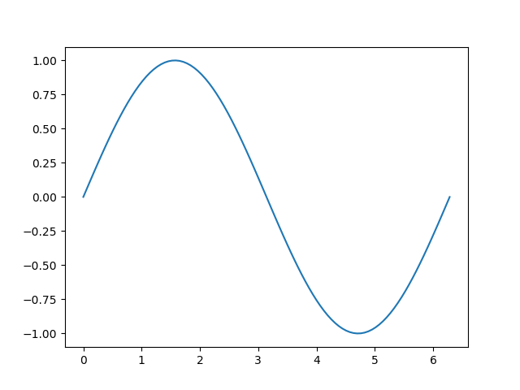

# Python para Análisis de Datos: NumPy

## Computo numérico en Python

El lenguaje Fortran con sus más de 50 años sigue siendo muy importante en las áreas de computo científico y de alto rendimiento. Fortran se considera la *referencia* cuando se habla de bibliotecas para cómputo numérico, bibliotecas como [LAPACK](http://www.netlib.org/lapack/) (Linear Algebra Package) o [BLAS](http://www.netlib.org/blas/) que sirven para realizar (entre otras cosas) operaciones con vectores y matrices, tienen más de 25 años de desarrollo. Fuera del computo científico el lenguaje no es tan popular lo que ha provocado que se desarrollen herramientas e incluso lenguajes de programación para realizar operaciones numéricas utilizando sus bibliotecas. Ejemplos de herramientas de código cerrado y propietario incluyen a MATLAB, Maple y Mathematica. El problema que tienen estas plataformas es que crean una dependencia del proveedor y además representan un alto costo a los usuarios. El problema mayor que tienen estas herramientas es que van en contra del movimiento de [ciencia abierta](https://es.wikipedia.org/wiki/Ciencia_Abierta). Existen opciones de código libre que incluso son compatibles con los productos anteriores, como [GNU Octave](https://www.gnu.org/software/octave/) y [SageMath](https://www.sagemath.org/). En el caso de lenguajes de programación libres, dos exponentes importantes son [Julia](https://julialang.org/) para el cómputo numérico y [R](https://www.r-project.org/) para el computo estadístico. En el caso de Python contamos con la biblioteca [NumPy](http://www.numpy.org/) como componente básico para el computo científico numérico. Numpy entre otras cosas nos brinda:

* Una estructura para arreglos de N-dimensiones.
* Herramientas para integrar de manera transparente código de Fortran y C//C++
* Soporte para álgebra lineal, transformadas de Fourier y números aleatorios.
* Integración con sistemas de bases de datos.
* Operaciones entre arreglos de distintas dimensiones (Broadcasting).

El código de NumPy tiene una [licencia de código abierto BSD](http://www.numpy.org/license.html#license).

NumPy se utiliza en conjunto con otras bibliotecas y herramientas como [matplotlib](https://matplotlib.org/), [SciPy](https://www.scipy.org/), [pandas](http://pandas.pydata.org/), [Jupyter](http://jupyter.org/), [IPython](https://github.com/ipython/ipython), [scikit-learn](http://scikit-learn.org/), [theano](http://www.deeplearning.net/software/theano/), [orange](https://orange.biolab.si/) para complementar una plataforma para el análisis de datos bastante decente. Una desventaja de tener tantos proyectos por separado es que podemos sufrir al momento de integrarlo, para evitarnos la pena se han desarrollado distribuciones que integran todo esto y más, por ejemplo [sage](https://www.sagemath.org/),[Canopy](https://www.enthought.com/product/canopy/) y [Anaconda Distribution](https://www.anaconda.com/distribution/).

Esta sección tipo taller, tiene como objetivo que conozcas y apliques los arreglos multidimensionales que ofrece la biblioteca NumPy. Estos conocimientos los utilizaremos en las secciones posteriores y de seguro lo agregarás a tu caja de herramientas.    

## NumPy: array

Mientras que en Python tenemos colecciones de objetos tipo secuencia como las listas, éstas no tienen una estructura adecuada que nos permita realizar operaciones generales sobre ellas. Como ejemplo tenemos la siguiente lista de listas:

```python
>>> lista_objetos = [[1,2,3],
                     [2,2],
                     ['Hola', 11],
                     [2]]
```
Esta lista tiene dos problemas: las listas son de distintos tamaños y tienen objetos de distintos tipos. Por ejemplo, no podemos sumar todos los números en la primera posición o en la tercera. En el primer caso no podemos sumar la cadena 'Hola' y en el segundo hay dos listas que no tienen un elemento en la tercera posición.

La estructura básica de NumPy es un arreglo homogéneo multidimensional. Dicho de otra manera, un arreglo es una lista que debe seguir ciertas reglas. Primero, es un arreglo homogéneo, es decir todos los elementos son del mismo tipo, casi siempre numérico. Segundo, todas las listas contenidas tienen el mismo tamaño. Vamos a crear una lista que siga estas reglas:

```python
>>> lista_nums = [[1, 2, 3],
                  [2, 2, 4],
                  [2, 3, 11],
                  [2, 1, 4]]
```

Esta lista es homogénea, ya que tiene puros enteros. Digamos que es rectangular ya que todas las listas interiores tienen el mismo número de elementos. Aunque no podemos decir todavía que es un arreglo homogéneo de dos dimensiones, vamos a crear un arreglo de NumPy a partir de nuestra lista:

```python
>>> import numpy as np
>>> arreglo = np.array(lista_nums)
>>> arreglo
array([[ 1,  2,  3],
       [ 2,  2,  4],
       [ 2,  3, 11],
       [ 2,  1,  4]])
```

Ahora sí. Una dimensión de este arreglo son los renglones y otra dimensión son las columnas. ¿Y su tipo de dato?:

```python
>>> arreglo.dtype
dtype('int64')
```
¿Que pasaría si queremos hacer un arreglo con la anterior lista de objetos?. Vamos a intentarlo:

```python
>>> arreglo_objs = np.array(lista_objetos)
>>> arreglo_objs
array([[1, 2, 3], [2, 2], ['Hola', 11], [2]], dtype=object)
```
Como vemos no se crea un arreglo de dos dimensiones, se crea un arreglo de una sola dimensión con objetos de un mismo tipo: **object**. Esto por supuesto no es muy útil. Nos damos cuenta que *arreglo_objs* es un arreglo de dimensión uno, homogéneo pero no de una manera muy útil ya que no podemos hacer muchas operaciones matemáticas con objetos tipo **object**.

Mejor vamos a crear un arreglo *Dimensión-1* que contenga solamente enteros:

```python
>>> arreglo_enteros = np.array([1 , 2, 45])
>>> arreglo_enteros
array([ 1,  2, 45])
```
Vamos a comparar el atributo dimensión de los arreglos:
```python
>>> arreglo.ndim
2
>>> arreglo_enteros.ndim
1
```
El número de dimensiones se le conoce en NumPy como el **rank** (rango) del arreglo. Un atributo importante es la *forma* (**shape**) del arreglo:

```python
>>> arreglo.shape
(4, 3)
```
El primer valor de la tupla nos dice el número de renglones y el segundo el número de columnas. Para acordarnos de este orden podemos imaginar que los arreglos o matrices son como los cines. Para encontrar nuestro asiento primero debemos ubicar la fila (renglón) y después el número de asiento. Veamos el caso del arreglo de una dimensión:

```python
>>> arreglo_enteros.shape
(3,)
```
En este caso podemos ver que se trata de un cine con un solo asiento por fila. El tamaño es el número de elementos, que como vemos es el equivalente del producto de los elementos de la tupla *shape*.

```python
>>> arreglo.size # 4*3
12
```

También podemos especificar el tipo de dato al crear el arreglo. Por ejemplo:
```python
>>> arreglo_complejos = np.array( [ [3 , 2], [3, 4] ], dtype=complex )
>>> arreglo_complejos
array([[ 3.+0.j,  2.+0.j],
       [ 3.+0.j,  4.+0.j]])
```

En ocasiones queremos crear arreglos con datos iniciales, por ejemplo ceros, unos o valores arbitrarios:
```python
 >>> np.zeros( (3,4) )
array([[ 0.,  0.,  0.,  0.],
       [ 0.,  0.,  0.,  0.],
       [ 0.,  0.,  0.,  0.]])
>>> np.ones( (2,3,4))  
array([[[ 1.,  1.,  1.,  1.],
        [ 1.,  1.,  1.,  1.],
        [ 1.,  1.,  1.,  1.]],

       [[ 1.,  1.,  1.,  1.],
        [ 1.,  1.,  1.,  1.],
        [ 1.,  1.,  1.,  1.]]])
>>> np.empty( (6,))  
array([ -2.68156159e+154,  -2.68156159e+154,   2.23182566e-314,
        -2.68156159e+154,   6.94181405e-310,   6.15378780e-313])
```

### Selección y cortes en arreglos multidimensionales

Vamos a considerar la siguiente lista de calificaciones donde cada alumno tiene tres calificaciones que van de 0 a 100:

| id |  nombre       | tarea | examen | proyecto |
|----|---------------|------:|-------:|---------:|
| 1  | Juan Pérez    |  86.2 | 90.0   | 95.0     |
| 2  | Ana Rivas     | 100.0 | 95.0   | 95.0     |
| 3  | María Sánchez |  76.5 | 100.0  | 85.0     |
| 4  | Luis Duarte   |  89.0 | 90.0   | 95.0     |

Vamos a capturar las calificaciones en un arreglo de NumPy:

```python
>>> lista_nums = [[86.2, 90.0, 95.0],[100.0, 95.0, 95.0],
                 [76.5, 100.0, 85.0], [89.0, 90.0, 95.0]]
>>> cal = np.array(lista_nums)
>>> cal
array([[  86.2,   90. ,   95. ],
       [ 100. ,   95. ,   95. ],
       [  76.5,  100. ,   85. ],
       [  89. ,   90. ,   95. ]])               
```

Los arreglos al igual que otros objetos tipo secuencia tienen indices que inician en cero. El arreglo *cal* tiene dos indices ya que tiene dos dimensiones o ejes (*axes*) en terminología NumPy. Para leer una posición enviamos una tupla con los indices, dos en este caso (*renglón*, *columna*):

``` python
>>> cal[1,0]
  100.0
>>> cal[(1,0)] # Podemos enviar un tupla
  100.0    
```
Veamos otros ejemplos:
``` python
>>> cal[:,0] # Todas las calificaciones de la tarea
  array([  86.2,  100. ,   76.5,   89. ])

>>> cal[:,0:2] # Tareas y exámenes
array([[  86.2,   90. ],
       [ 100. ,   95. ],
       [  76.5,  100. ],
       [  89. ,   90. ]])

>>> cal[1:3,:] # Calificaciones de Ana y María
array([[ 100. ,   95. ,   95. ],
       [  76.5,  100. ,   85. ]])
```

Cuando enviamos una tupla con menos indices de los que tiene el arreglo, se considera queremos regresar todos los elementos de los ejes restantes:

``` python
>>> cal[0] # Equivalente a cal[0,:]
    array([ 86.2,  90. ,  95. ])
```

Otra manera de indicar lo mismo es utilizando tres puntos (...).

``` python
>>> cal[0, ...]
    array([ 86.2,  90. ,  95. ])

>>> cal[...]
    array([[  86.2,   90. ,   95. ],
           [ 100. ,   95. ,   95. ],
           [  76.5,  100. ,   85. ],
           [  89. ,   90. ,   95. ]])

>>> cal[...,2] # Tercera columna
   array([ 95.,  95.,  85.,  95.]
```


## Operaciones básicas

Cuando utilizamos operaciones aritméticas sobre arreglos, la operación se realiza para cada elemento y se regresa un nuevo arreglo con el resultado. Vamos a suponer que debido al buen desempeño de todos los alumnos se subirá un punto a todas las calificaciones:

``` python
>>> cal + 1
array([[  87.2,   91. ,   96. ],
       [ 101. ,   96. ,   96. ],
       [  77.5,  101. ,   86. ],
       [  90. ,   91. ,   96. ]]
```
También lo podríamos hacer solo para el primer alumno:

``` python
>>> cal[0] + 1
array([ 87.2,  91. ,  96. ])
```
En este caso no se ha modificado todavía el arreglo *cal*, solo estamos regresando una vista.

Las operaciones también se pueden hacer entre arreglos. Por ejemplo, vamos a suponer que tenemos un arreglo con los puntos extra que han obtenido los alumnos:

``` python
>>> puntos = [[0, 1, 0],[1, 0, 0], [0, 0, 0], [1, 2, 4]]
>>> extras = np.array(puntos)    
>>> extras
array([[0, 1, 0],
       [1, 0, 0],
       [0, 0, 0],
       [1, 2, 4]])

>>> cal
array([[  86.2,   90. ,   95. ],
       [ 100. ,   95. ,   95. ],
       [  76.5,  100. ,   85. ],
       [  89. ,   90. ,   95. ]])

>>> cal + extras
array([[  86.2,   91. ,   95. ],
       [ 101. ,   95. ,   95. ],
       [  76.5,  100. ,   85. ],
       [  90. ,   92. ,   99. ]])
```
En este caso tenemos una calificación errónea ya que no se puede tener 101 de calificación.

Vamos ahora a suponer que deseamos ponderar cada una de las calificaciones, por ejemplo:

| tarea | examen | proyecto |
|------:|-------:|---------:|
|  .30  | .30    | .40      |

NumPy permite realizar operaciones entre arreglos con distinta forma (shape) mediante un mecanismo que llaman *Broadcast*. En este caso se hace una búsqueda de una operación que tenga sentido. Por ejemplo:

```python
>>> pesos = np.array([.30, .30, .40])
>>> cal * pesos
array([[ 25.86,  27.  ,  38.  ],
       [ 30.  ,  28.5 ,  38.  ],
       [ 22.95,  30.  ,  34.  ],
       [ 26.7 ,  27.  ,  38.  ]])
```
Implícitamente se completa la matriz de pesos para que tenga la misma forma que **cal** y después se hace la multiplicación como siempre, posición por posición.

Para saber la calificación final de cada alumno debemos sumar sus calificaciones ponderadas. Esto lo hacemos aplicando la función suma a los elementos del eje correspondiente (axis=1). Veamos:

```python
>>> cal_ponderada = cal * pesos
>>> cal_ponderada.sum(axis=1)
array([ 90.86,  96.5 ,  86.95,  91.7 ])  
```
El parámetro *axis=1* indica que se suman los renglones, si hubiéramos pasado *axis=0* se sumarían las columnas.

Para finalizar esta sección vamos a resolver un problema. ¿Como podríamos crear la una matriz de pesos que tenga la misma forma que *cal*?. Digamos algo así:
```python
>>> pesos
array([[ 0.3,  0.3,  0.4],
       [ 0.3,  0.3,  0.4],
       [ 0.3,  0.3,  0.4],
       [ 0.3,  0.3,  0.4]])
```
Para resolver el problema debemos aprovechar las propiedades de los arreglos. Primero vamos a generar un arreglo con la forma de *cal* pero que contenga solo unos:

```python
>>> unos = np.ones((4,3))  
>>> unos
array([[ 1.,  1.,  1.],
       [ 1.,  1.,  1.],
       [ 1.,  1.,  1.],
       [ 1.,  1.,  1.]])
```
Después simplemente multiplicamos este arreglo por el arreglo *pesos*:

```python
>>> pesos = np.array([.30, .30, .40])
>>> unos * pesos
array([[ 0.3,  0.3,  0.4],
       [ 0.3,  0.3,  0.4],
       [ 0.3,  0.3,  0.4],
       [ 0.3,  0.3,  0.4]])
```
Para lograr el mismo objetivo, ¿Podríamos utilizar un arreglo con ceros *np.zeros((4,3))*?

Es importante recordar que estas operaciones no pueden realizarse en las listas convencionales de Python, por ejemplo:

```python
>>> lista = [2,3,4]
>>> lista * 5
[2, 3, 4, 2, 3, 4, 2, 3, 4, 2, 3, 4, 2, 3, 4]

>>> np.array([2,3,4]) * 5
array([10, 15, 20])
```

### Selección con arreglos de booleanos

Podemos enviar un arreglo de booleanos para seleccionar elementos de un arreglo. Por ejemplo, a las calificaciones iguales a 95 le vamos a sumar 5 punto:

Primero vamos a crear nuestro filtro:
```python
>>> cal == 95
array([[False, False,  True],
       [False,  True,  True],
       [False, False, False],
       [False, False,  True]], dtype=bool)
>>> filtro = cal == 95
```
Si te fijas cada posición que cumple con la condición de *cal == 95* tiene *True*. Ahora vamos a modificar a aquellos elementos que cumplan con la condición:

```python
>>> cal[filtro]
array([ 95.,  95.,  95.,  95.]) # Solo los valores que tienen True
>>> cal[filtro]+= 5  # Le sumamos 5 al valor actual
>>> cal   
array([[  86.2,   90. ,  100. ],
       [ 100. ,  100. ,  100. ],
       [  76.5,  100. ,   85. ],
       [  89. ,   90. ,  100. ]])
>>>
```

Podemos utilizar esta técnica también para filtrar columnas por ejemplo:
```python
>>> cal[:, np.array([False, True, True])]
array([[  90.,  100.],
       [ 100.,  100.],
       [ 100.,   85.],
       [  90.,  100.]])
```
Como utilizamos un operador de asignación efectivamente estamos modificando al arreglo *cal*.

### Iteración

En ocasiones necesitamos recorrer el arreglo haciendo alguna operación sobre los datos. ¡Cuidado! debemos tratar de utilizar lo menos posible el ciclo *for* para realizar operaciones con el arreglo. Por un lado debemos acostumbrarnos a un estilo de programación más funcional o estilo python (*pythonic*). Piensa siempre primero en como hacerlo utilizando comprensión de listas u operaciones a nivel de arreglo como vimos anteriormente.   

Como última opción, cuando utilizamos ciclos en arreglos estos se hacen a partir del primer eje:

```python
>>> for row in cal:
...     print(row)
...
[  86.2   90.   100. ]
[ 100.  100.  100.]
[  76.5  100.    85. ]
[  89.   90.  100.]
```

Podemos leer todos los elementos del arreglo secuencialmente con el atributo *flat* (plano):

``` python
>>> for item in cal.flat:
...     print (item)
...
86.2
90.0
100.0
100.0
100.0
100.0
76.5
100.0
85.0
89.0
90.0
100.0
```

### Generación de arreglos con números secuenciales

En Python utilizamos la función *range()* para generar listas de números con secuencias de enteros. De manera similar en NumPy utilizamos *arange()* para generar arreglos de NumPy con valores secuenciales.

```python
>>> np.arange(10)
array([0, 1, 2, 3, 4, 5, 6, 7, 8, 9])

>>> np.arange(0, 10,.33)
array([ 0.  ,  0.33,  0.66,  0.99,  1.32,  1.65,  1.98,  2.31,  2.64,
        2.97,  3.3 ,  3.63,  3.96,  4.29,  4.62,  4.95,  5.28,  5.61,
        5.94,  6.27,  6.6 ,  6.93,  7.26,  7.59,  7.92,  8.25,  8.58,
        8.91,  9.24,  9.57,  9.9 ])
```
En el segundo caso utilizamos un flotante para decirle a la función que nos genere números del 0 al 10, avanzando con pasos de 0.33. Un problema que podemos tener en este caso es que no sabemos cuantos elementos se van a generar y que tanto se acercará al valor final (en este caso 10). Para evitar esto, tenemos la función *linspace()* a la cual le decimos, dame 31 valores entre 0 y 10 inclusive:

``` python
>>> np.linspace(0, 10,31)
array([  0.        ,   0.33333333,   0.66666667,   1.        ,
         1.33333333,   1.66666667,   2.        ,   2.33333333,
         2.66666667,   3.        ,   3.33333333,   3.66666667,
         4.        ,   4.33333333,   4.66666667,   5.        ,
         5.33333333,   5.66666667,   6.        ,   6.33333333,
         6.66666667,   7.        ,   7.33333333,   7.66666667,
         8.        ,   8.33333333,   8.66666667,   9.        ,
         9.33333333,   9.66666667,  10.        ])
```
De esta manera sabemos exactamente cuantos valores tendremos. Esta función se utiliza mucho para graficar funciones ya que nos genera los valores de *x* con los que vamos a evaluar la función.  

Un ejemplo clásico es el siguiente:

``` python
>>> import matplotlib.pyplot as plt
>>> from numpy import pi
>>> x = np.linspace( 0, 2*pi, 100 ) # 100 números entre 0 y 2pi
>>> f = np.sin(x) # Creamos un arreglo con los resultados de sin(x)
>>> plt.plot(x,f) # Graficamos
>>> plt.show()    
```



Las funciones  *linspace()* y *range()* generan arreglos de Dimensión-1, no te preocupes, podemos crear arreglos de mayor rango con la función de *reshape()*:

``` python
>>> np.linspace(0, 10,30).reshape(6,5)
array([[  0.        ,   0.34482759,   0.68965517,   1.03448276,
          1.37931034],
       [  1.72413793,   2.06896552,   2.4137931 ,   2.75862069,
          3.10344828],
       [  3.44827586,   3.79310345,   4.13793103,   4.48275862,
          4.82758621],
       [  5.17241379,   5.51724138,   5.86206897,   6.20689655,
          6.55172414],
       [  6.89655172,   7.24137931,   7.5862069 ,   7.93103448,
          8.27586207],
       [  8.62068966,   8.96551724,   9.31034483,   9.65517241,  10.        ]])
```

