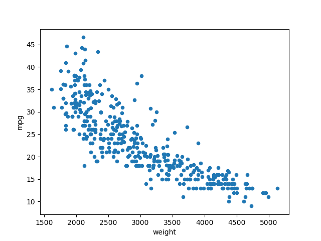
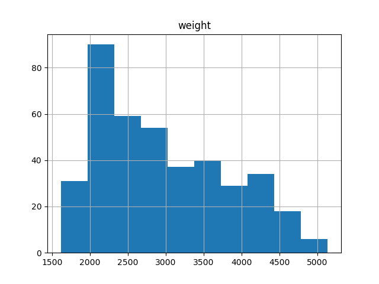
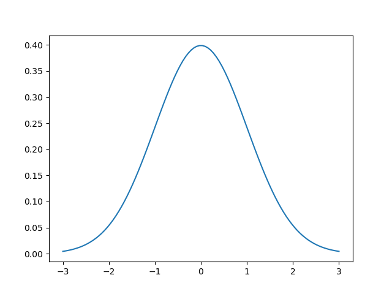
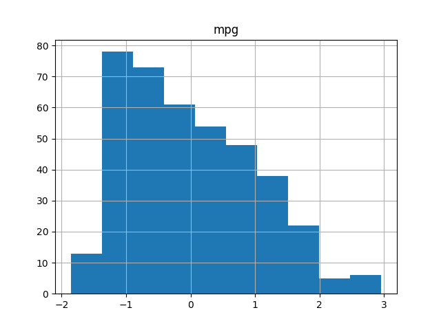
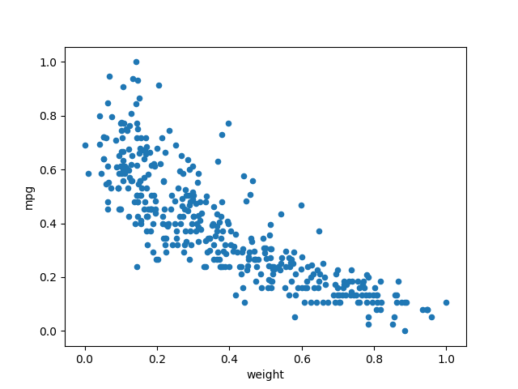
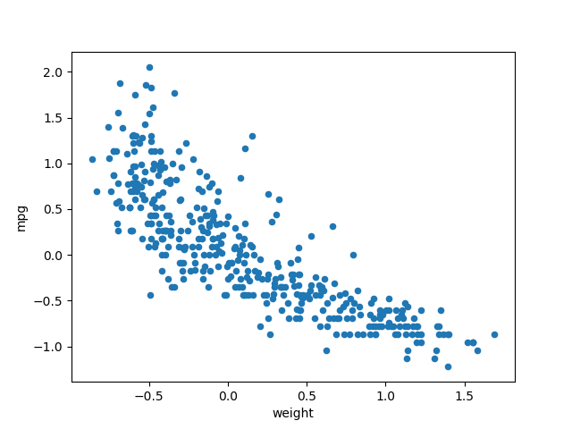
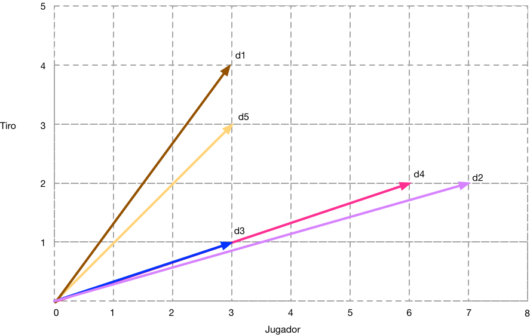
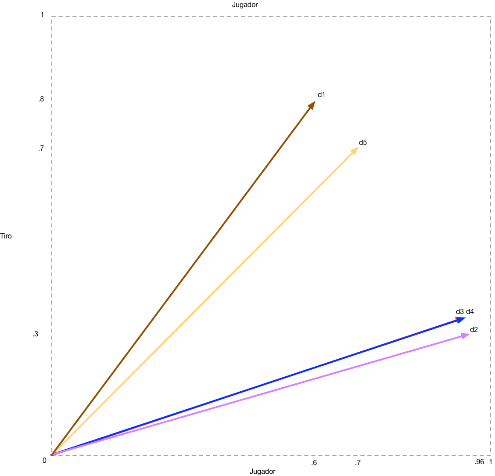
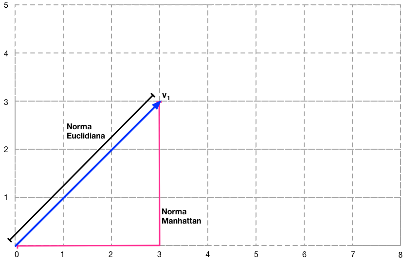

## Preprocesamiento

En esta etapa vamos a procesar los objetos crudos para pasarlos a representaciones favorables para los algoritmos que utilizaremos más adelante. También es conveniente reducir en los posible la cantidad de datos y los atributos de los objetos para no incrementar el costo computacional. Para lograr lo anterior, en la etapa de preprocesamiento podemos realizar algunas de estas tareas:

* Estandarización
* Escalado
* Normalización
* Agregación
* Codificación de atributos categóricos
* Muestreo
* Reducción de la dimensión
* Creación de características
* Transformación de atributos


### Estandarización

Muchos algoritmos de aprendizaje automático requieren que los datos estén normalizados para funcionar correctamente. Vamos a entender la razón por medio de un ejemplo. Vamos a observar de nuevo los datos de auto-mpg:

``` python
>>> import numpy as np
>>> import pandas as pd
>>> import matplotlib.pyplot as plt
>>> auto_mpg = pd.read_csv('datos-ejemplo/auto-mpg.data', sep='\s+',
     header=None,  na_values='?', names=['mpg','cylinders','displacement','horsepower',
        'weight','acceleration','model_year','origin','car_name'],
     dtype={'mpg':'f4', 'cylinders':'i4',
        'displacement':'f4','horsepower':'f4','weight':'f4',
        'acceleration':'f4','model_year':'i4','origin':'category',
        'car_name':'category'})

>>> auto_mpg["origin"].cat.categories = ["USA", "Japan", "Germany"]
>>> auto_mpg.tail(3)
      mpg  cylinders  displacement  horsepower  weight  acceleration  \
395  32.0          4         135.0        84.0  2295.0          11.6   
396  28.0          4         120.0        79.0  2625.0          18.6   
397  31.0          4         119.0        82.0  2720.0          19.4   

     model_year origin       car_name  
395          82    USA  dodge rampage  
396          82    USA    ford ranger  
397          82    USA     chevy s-10  
```
Nos vamos a concentrar en dos atributos: *weight* y *mpg*, vamos a graficar a los objetos:

``` python
>>> auto_mpg.plot.scatter(x='weight', y='mpg');
>>> plt.show()
```



Nos damos cuenta al observar la gráfica (o la tabla) que los valores numéricos son muy distintos, una diferencia de 20 unidades en el caso de mpg es mucha, mientras que en el peso no es así.

Ahora veamos como están distribuidos los valores utilizando un histograma:

``` python
>>> auto_mpg.hist(column='weight');
>>> plt.show()
```



``` python
>>> auto_mpg.hist(column='mpg');
>>> plt.show()
```


Si te fijas algunos valores se repiten más que otros, por ejemplo en el caso de las millas por galón vemos que un auto con 40 mpg es mucho menos probable que uno con 20 mpg. Si asumimos que los valores siguen una distribución normal podríamos calcular la probabilidad de tener 10, 30 o 40 mpg, si conocemos la media y la desviación estándar. Esto se simplifica bastante si los datos siguen una distribución normal estandarizada, es decir una distribución normal con una media de 0 y una desviación estándar de 1.  

Para transformar los datos que tenemos solo debemos de utilizar la siguiente ecuación:

$$
Z = \frac{(X – \mu)}{\sigma} 
$$

Es decir el *z-score* para un valor $X$ es $X$ menos la  media, dividido entre la desviación estándar.

Podemos observar gráficamente esta distribución:

``` python
>>> import math
>>> import matplotlib.mlab as mlab

>>> mu = 0
>>> variance = 1
>>> sigma = math.sqrt(variance)
>>> x = np.linspace(mu - 3*sigma, mu + 3*sigma, 100)
>>> plt.plot(x,mlab.normpdf(x, mu, sigma))
>>> plt.show()
```




Podemos estandarizar los datos utilizando la biblioteca sci-kitlearn:

``` python
>>> from sklearn import preprocessing
>>> datos = auto_mpg.loc[ :, ['mpg','weight']]
>>> datos_estandarizados = preprocessing.scale(datos)
>>> df = pd.DataFrame(datos_estandarizados)
>>> df.plot.scatter(x='weight', y='mpg');
>>> plt.show()
```


Vemos que ahora los valores numéricos no son tan distintos y en el caso del histograma de mpg:

``` python
>>> df.hist(column='mpg');
>>> plt.show()
```



Nos damos cuenta que los datos siguen una distribución sesgada a la izquierda cuando la comparamos con la distribución normalizada anteriormente.   

En muchos casos vamos a realizar este proceso en varios conjuntos de datos, por lo que el modulo *preprocessing* nos brinda la clase *StandardScaler* para calcular la media y desviación estándar en un conjunto de entrenamiento para después hacer la misma estandarización en el conjunto de datos de prueba. Hablaremos sobre estos conjuntos de datos en la sección de clasificación.

### Escalado a un rango

Otra transformación que podemos hacer para *weight* y *mpg*, es cambiar la  escala de los valores a un rango entre cero y uno. Podemos hacerlo de la siguiente manera:


``` python
>>> datos = auto_mpg.loc[ :, ['mpg','weight']]
>>> min_max_scaler = preprocessing.MinMaxScaler()
>>> datos_minmax = min_max_scaler.fit_transform(datos)
>>> df = pd.DataFrame(datos_minmax,columns=['mpg','weight'] )
>>> df.plot.scatter(x='weight', y='mpg');
>>> plt.show()
```



Para escalar a otros rangos enviamos una tupla en el constructor, por ejemplo:

``` python
>>> min = -1
>>> max = 1
>>> min_max_scaler = preprocessing.MinMaxScaler( feature_range=(min, max))
```

### Escalado con valores atípicos

En caso de que los datos que estamos procesando incluyan valores atípicos, debemos utilizar una función de escalado que utilice una estadística que tolere *outliers*. Una estrategia es utilizar la mediana y escalar los datos de acuerdo a rangos establecidos por percentiles. En el caso de la clase *RobustScaler* de scikit-learn, por defecto se utiliza el rango entre el primer (percentil 25%) y tercer (percentil 75%) cuartil.

``` python
>>> datos = auto_mpg.loc[ :, ['mpg','weight']]
>>> robust_scaler = preprocessing.RobustScaler()
>>> datos_robustos  = robust_scaler.fit_transform(datos)
>>> df = pd.DataFrame(datos_robustos,columns=['mpg','weight'] )
>>> df.plot.scatter(x='weight', y='mpg');
<matplotlib.axes._subplots.AxesSubplot object at 0x11f5e6050>
>>> plt.show()
```



## Medidas de Similaridad y Normalización

Algunos algoritmos de clasificación de textos utilizan una representación de los documentos llamada [modelo de espacio vectorial](https://es.wikipedia.org/wiki/Modelo_de_espacio_vectorial). En este modelo, cada documento es representado como un vector en el cual cada componente representa la ponderación de cierto término en el documento. Por ejemplo, veamos la representación de cuatro documentos:

|    | Home Run | Gol  | Jugador | Penal |  Tiro | Doble Play |
|----|----------|------|---------|-------|-------|------------|
| d1 |     3    |  0   |    3    |  0    | 4     |   2        |  
| d2 |     0    |  5   |    7    |  3    | 2     |   0        |
| d3 |     0    |  0   |    3    |  3    | 1     |   0        |
| d4 |     5    |  0   |    6    |  0    | 2     |   3        |
| d5 |     5    |  0   |    3    |  0    | 3     |   3        |

El Documento 1, habla de beisbol, por lo que no aparecen en él, los términos Gol ni Penal. Por otro lado, el Documento 2 habla de fútbol, por lo que no se menciona el término *Home Run*. Una manera de medir que tan parecidos o distintos son los documentos es simplemente calculando el producto punto entre los vectores, de tal manera que la similaridad está representada por el ángulo entre ellos.

Vamos a considerar un caso bien básico, que los documentos solo tiene dos términos: *Jugador* y *Tiro*. Al tener solo vectores con dos componentes, los podemos representa de la siguiente manera:



Los documentos menos similares son el d1 y d2, ya que el ángulo entre ellos es mayor. Los más similares son d3 y d4 ya que tienen el mismo ángulo. El cálculo de estos ángulos se simplifica si todos los vectores tienen una longitud unitaria [ver](https://es.wikipedia.org/wiki/Vector_unitario#Producto_escalar_de_dos_vectores). Por lo anterior es común normalizar (o escalar) los vectores a una longitud unitaria,  dividiendo cada componente entre la longitud euclidiana del vector (a esto se le llama norma L2). Como vemos en la siguiente figura los vectores se han escalado considerando una longitud o norma euclidiana. Aunque cada documento sigue teniendo el mismo ángulo todos tienen una longitud unitaria.



``` python
>>> from sklearn import preprocessing
>>> import numpy as np

>>> X = np.array([[ 3., 4.], [7., 2.], [3., 1.], [6., 2.], [3., 3.] ])
>>> X_normalized = preprocessing.normalize(X, norm='l2')

>>> X_normalized
array([[ 0.6       ,  0.8       ],
       [ 0.96152395,  0.27472113],
       [ 0.9486833 ,  0.31622777],
       [ 0.9486833 ,  0.31622777],
       [ 0.70710678,  0.70710678]])
```

En este ejemplo los documentos d3 y d4 tienen la misma dirección por lo que se consideran documentos iguales, lo comprobamos con el producto punto que nos da 1.

``` python
>>> np.dot(X_normalized[2],X_normalized[3])
   0.99999999999999989
```

En ocasiones también se utiliza una norma L1, también llamada distancia Manhattan.



``` python
>>> X_manhattan = preprocessing.normalize(X, norm='l2')
>>> X_manhattan
array([[ 0.42857143,  0.57142857],
       [ 0.77777778,  0.22222222],
       [ 0.75      ,  0.25      ],
       [ 0.75      ,  0.25      ],
       [ 0.5       ,  0.5       ]])
```

## Datos Agregados

Imagina que eres el ejecutivo de una cadena de librerías y tienes que tomar decisiones a cerca de los productos que se deben de promover en la siguiente temporada. Para apoyarte en la toma de decisiones utilizas un sistema [OLAP](https://es.wikipedia.org/wiki/OLAP)  el cual te permite ver los datos de las ventas con distintos nivel de detalle. Puedes ir desde el nivel de granularidad más bajo:

|  Producto      |  Cantidad | Tienda | Ciudad |  Pais |  Fecha   | Mes | Año|
|----------------|-----------|--------|--------|-------|----------|-----|----|  
|  El Principito |     3     |  123   |  LA    |  USA  | 10/02/16 | FEB |2016|  
|  El Principito |     0     |  156   |  LA    |  USA  | 10/02/16 | FEB |2016|
|  El Hobbit     |     5     |  123   |  LA    |  USA  | 10/02/16 | FEB |2016|
|  El Hobbit     |     1     |  156   |  LA    |  USA  | 10/02/16 | FEB |2016|

Lo que vemos son las ventas diarias de cada libro en cada tienda. Como la información es muy detallada prefieres verla a otro nivel de detalle, por ejemplo:

|  Producto      |  Cantidad  | Ciudad   | Pais   |  Mes  | Año|
|----------------|------------|----------|--------|-------|----|  
|  El Principito |     10     |   LA     |  USA   | ENE   |2016|
|  El Principito |     30     |   LA     |  USA   | FEB   |2016|
|  El Hobbit     |     30     |   LA     |  USA   | ENE   |2016|
|  El Hobbit     |     30     |   LA     |  USA   | FEB   |2016|

Esta vista te presenta los datos agregados por ciudad y mes. Agregar los datos consiste en hacer grupos que coincidan en determinado atributo y realizar alguna operación sobre el grupo, sumarlos en este caso. Podemos agregar todavía más:

|  Producto      |  Cantidad  | Pais     |  Año  |
|----------------|------------|----------|-------|  
|  El Principito |   29,203   | México   | 2016  |
|  El Principito |   29,788   | USA      | 2016  |
|  El Hobbit     |   18,987   | México   | 2017  |
|  El Hobbit     |   36,699   | USA      | 2017  |

Dependiendo del tipo de análisis que estés haciendo será el tipo de agrupación que necesites. Como agregar reduce la cantidad de datos, tenemos las siguientes ventajas:

* Si solo almacenamos los datos agregados, ahorramos espacio de almacenamiento.
* Se reduce el número de atributos.
* Los datos agrupados tienen menor variabilidad.

Los datos agregados tienen mucha importancia en los sistemas de toma de decisiones, almacenes de datos y el concepto de cubos de datos. Este tema se revisa con mayor detalle en la sección de OLAP.

* Codificación de atributos categóricos

Muchos algoritmos de aprendizaje automático solo pueden recibir como entrada vectores de características con valores continuos. ¿Qué hacemos con aquellos objetos que tienen atributos con valores categóricos?. Por ejemplo, una persona puede tener el atributo genero ["masculino", "femenino"] o estado civil  ["soltero","en una relación","casado", "es complicado", "divorciado","viudo"]. Una manera de común de solucionar este problema es simplemente asignarle un número entero a cada opción. Así, los valores de genero  ["masculino", "femenino"] los cambiamos a [ 0, 1] y las opciones de estado civil que acabo de decir, quedaría como [0, 1, 2, 3, 4, 5]. El problema que tiene esta solución es que se asume un orden, pero estos atributos no son ordinales; lo cual puede ser un problema en algunos casos.

Una manera sencilla de codificar los valores categóricos es utilizando una representación binaria. En esta representación se agrega un atributo por cada valor posible, así el atributo genero quedaría de la siguiente manera:

Original:

|  Nombre  |  Genero      |
|----------|--------------|
|  Ana     |   Femenino   |
|  Tom     |   Masculino  |
|  Sue     |   Femenino   |
|  Jim     |   Masculino  |

Representación Binaria:

|  Nombre  |  Femenino    | Masculino  |
|----------|--------------|------------|
|  Ana     |      1       |    0       |
|  Tom     |      0       |    1       |
|  Sue     |      1       |    0       |
|  Jim     |      0       |    1       |

Esta representación convierte cada atributo categórico con n valores posibles a n atributos binarios. Indicamos el valor categórico activando el atributo de la opción correspondiente; todos los otros atributos se desactivan. Para desactivar o activar los valores se utiliza el cero y uno respectivamente. De esta manera el atributo estado civil visto anteriormente quedaría:

| Nombre| Soltero| En una relación|Casado|Es complicado| Divorciado| Viudo |
|-------|--------|----------------|------|-------------|-----------|-------|
|  Ana  |    1   |       0        |  0   |      0      |    0      |  0    |  
|  Tom  |    0   |       0        |  0   |      0      |    1      |  0    |  
|  Sue  |    0   |       0        |  1   |      0      |    0      |  0    |  
|  Jim  |    1   |       0        |  0   |      0      |    0      |  0    |  

Vamos a practicar codificando el atributo origin de nuestro dataset *auto_mpg*. Recordemos que el atributo origin puede tener los valores categóricos: [0, 1, 2] que corresponden a ["USA", "Japan", "Germany"]. Vamos a utilizar el codificador *OneHotEncoder* de la biblioteca *sklearn*. Esta implementación solo puede codificar números enteros y no acepta valores nulos. Basándonos en el código visto anteriormente, primero importamos el módulo *preprocessing*. Despues creamos un objeto codificador (enc) con el constructor *OneHotEncoder()*. Vamos a construir el codificador con el método fit(), a cual le enviamos como parámetro la columna *origin*. Ya una vez creado el codificador, podemos continuar pidiéndole que transforme la columna original. La transformación la guardamos temporalmente en *a*. La transformación es una arreglo escaso (sparse array), por consiguiente, si lo queremos desplegar debemos convertirlo a un array. En el ejercicio imprimimos el primer renglón, como vemos tiene tres columnas y la primera es 1, es decir: "USA".


``` python
>>> import numpy as np
>>> import pandas as pd
>>> import matplotlib.pyplot as plt
>>> from sklearn import preprocessing

>>> auto_mpg = pd.read_csv('auto-mpg.data', sep='\s+',
     header=None,  na_values='?', names=['mpg','cylinders','displacement','horsepower',
        'weight','acceleration','model_year','origin','car_name'],
     dtype={'mpg':'f4', 'cylinders':'i4',
        'displacement':'f4','horsepower':'f4','weight':'f4',
        'acceleration':'f4','model_year':'i4','origin':'category',
        'car_name':'category'})
>>> auto_mpg["origin"].cat.categories = ["USA", "Japan", "Germany"]

>>> enc = preprocessing.OneHotEncoder()
>>> enc.fit(auto_mpg[['origin']])
>>> a = enc.transform(auto_mpg[['origin']])
>>> a.toarray()[0]
>>> array([ 1.,  0.,  0.])
```

## Muestreo

En estadística el muestreo es una herramienta de la investigación científica, que tiene como objetivo determinar la selección de una muestra de objetos de una población, que nos permita realizar inferencias sobre dicha población.
Trabajamos con muestras, por que puede ser muy difícil o costoso analizar a todos los objetos de una población. Si la muestra es representativa, podemos reducir los costos llegando a las mismas conclusiones. En ocasiones simplemente no tenemos datos suficientes por la dificultad que representa obtenerlos. Cuando hablamos de minería de datos, parecería que tenemos el problema contrario, partimos de datos que se han recolectado en ocasiones masivamente, considerando objetos con un gran número de atributos. Debido a la gran cantidad de datos disponible, es necesario utilizar muestras para reducir el costo computacional del análisis. También se utilizan distintas técnicas de muestreo con el objetivo de evaluar los modelos o comparar distintos algoritmos de aprendizaje automático. Las técnicas de muestreo utilizadas en minería de datos se basan en las técnicas estándar de estadística. Algunas de las técnicas más utilizadas son el muestreo aleatorio simple o estratificado, con o sin reemplazo. Cuando se busca estimar el desempeño de los modelos, se utilizan técnicas de partición de datos, como leave-one-out y validación cruzada de k-particiones  (k-fold cross validation). Veamos ejemplos de cada tipo.

### Muestreo aleatorio simple

Este tipo de muestreo puede aplicarse cuando podemos calcular la probabilidad de selección de cada uno de los objetos. En el caso de minería de datos, nosotros tenemos mucho control sobre la selección de objetos que hacemos en datos electrónicos disponibles. Pero debemos tener cuidado, la validez de nuestras inferencias podrían no ser representativas de los objetos del mundo real; debido a un sesgo de origen, causado desde la misma recolección de los datos. El muestreo entonces es probabilístico, debido a que cualquiera de los objetos tiene una probabilidad de ser seleccionado. Los tipos de muestreo aleatorio simple son:

* Sin reemplazo: Cada objeto seleccionado se extrae de la población, por lo que ya no podrá ser seleccionado otra vez. Debemos considerar que cuando extraemos los objetos, el tamaño de la población y por lo tanto la probabilidad que tienen los objetos de ser seleccionados ira cambiando.

* Con reemplazo: Los objetos seleccionados se reinsertan a la población, un objeto puede ser seleccionado más de una vez y el tamaño de la población permanece constante.

### Muestreo sistemático

En esta técnica se van removiendo objetos de una lista circular ordenada, se elige un punto de inicio al azar  y utilizando intervalo correspondiente para el tamaño de la muestra, vamos dando saltos seleccionando a los demás objetos.

### Muestreo estratificado

En ocasiones tenemos objetos que comparten cierta característica que nos permite agruparlos, pero se tiene el problema que los objetos de ese grupo son muy pocos comparados con la población en general. Por ejemplo los deportistas de Polo comparados con los de Fútbol. Si buscamos que todos los grupos estén representados en la muestra aleatoria, podemos hacer un muestreo estratificado. Para esto asignamos primero una cuota para cada grupo, por ejemplo 100 futbolistas y 2 jugadores de polo. Dentro de cada grupo o estrato utilizamos una técnica de muestreo sistemático.

### Muestro por conglomerados (*cluster sampling*)

En ocasiones existen agrupamientos (o clusters) de objetos homogéneos en una población. Por ejemplo, grupos de estudiantes de alguna universidad con sedes en distintos estados; en general los grupos tienen características similares. Sin embargo, los elementos que constituyen cada agrupamiento (los estudiantes) deben ser diferentes entre sí; estudiantes de distintos semestres, carreras, calificaciones, etc. En estos casos se hace una selección aleatoria de los grupos. Por ejemplo, se eligen al azar un número de universidades, después en las universidades seleccionadas una muestra aleatoria de alumnos contestarán una encuesta. Esto puede ahorrar dinero a los investigadores, pues si hubieran elegido alumnos al azar deberían aplicar la encuesta en muchas universidades.

### Muestreo aleatorio simple en Python

Igual en algunos casos, podemos utilizar la biblioteca estándar de Python *random* para tomar muestras aleatorias de secuencias de objetos:

``` python
>>> import random
>>> pop = ["juan","luis","paco", "pedro","jorge","victor","ana","ada","megan","emma"]
>>> random.sample(pop, 3)
['juan', 'luis', 'emma']
>>> random.sample(range(100000000), 3)
[67307206, 72755273, 50751539]
```
