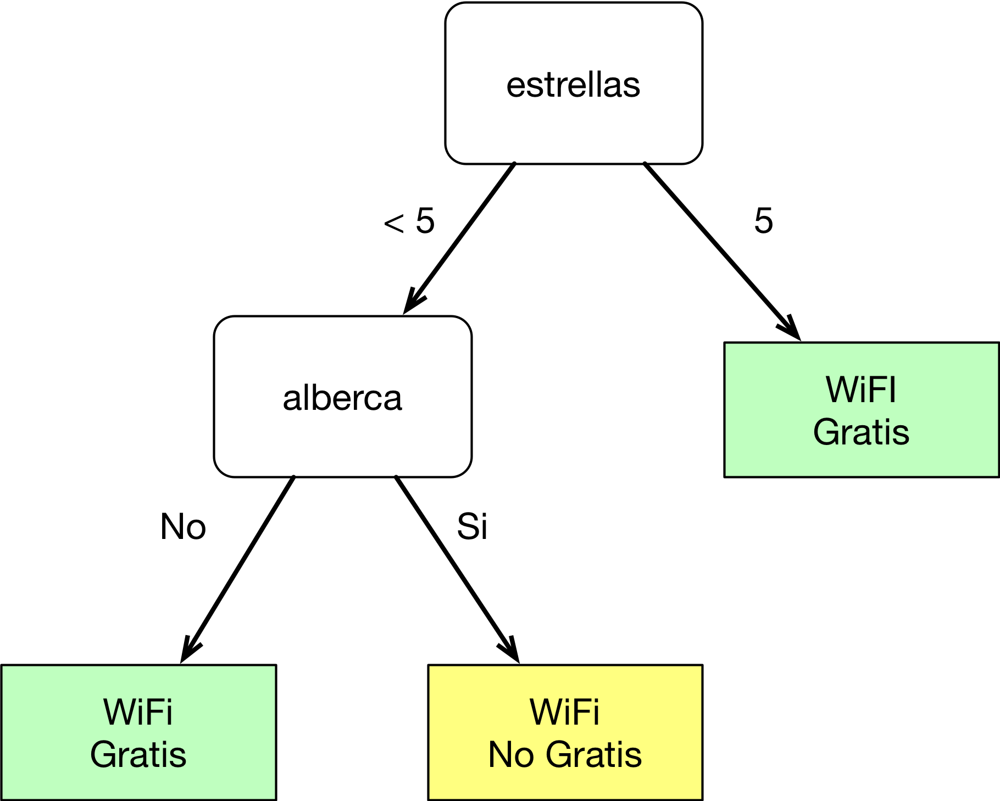
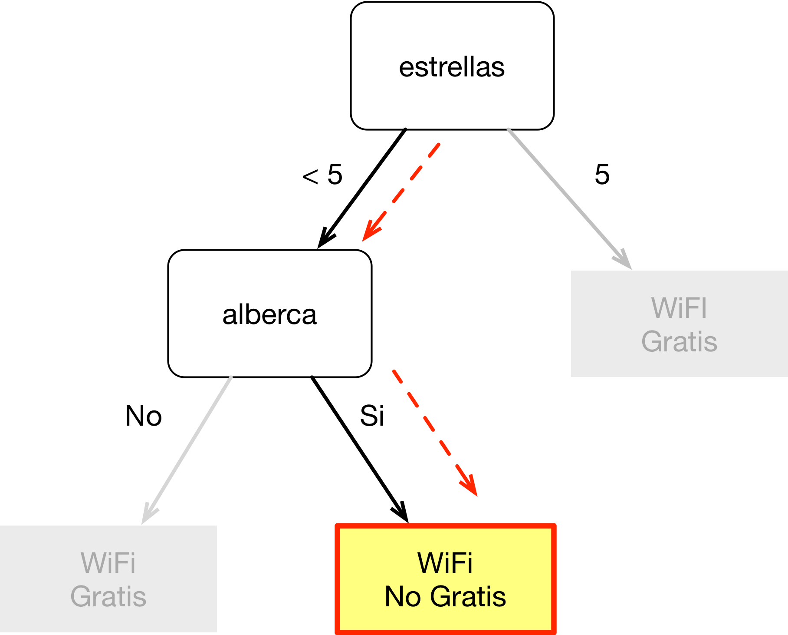
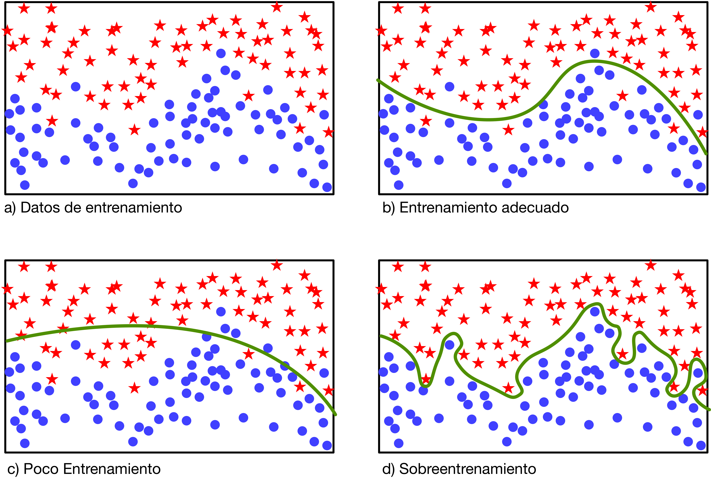
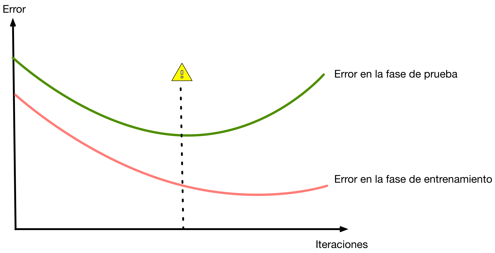

# Clasificación Básica

## Preliminares

Clasificar consiste en asignar a los objetos una categoría la cual
seleccionamos de un conjunto previamente definido. Esta es una tarea necesaria
en muchos sistemas informáticos, por ejemplo, una funcionalidad básica de los
servicios de correo electrónico es la de asignar automáticamente los mensajes
recibidos a una de dos categorías: *correo válido* o *correo no deseado*. Para
clasificar los correos, el sistema considera ciertas características del correo
como son el titulo y el texto del mensaje. Podemos ver a un clasificador como
una función la cual toma las características de un objeto y nos regresa la
categoría a la que pertenece. Un ejemplo de un clasificador muy sencillo podría
ser uno que simplemente considere si el mensaje incluye ciertos términos:

``` python
def clasificador(mensaje):
    for palabra in ['Rolex', 'Buy Bitcoins', 'Free Vacations']:
        if palabra in mensaje
            return 'spam'
    return 'ham'
```

Este clasificador no es muy bueno ya que los creadores de correos no deseados
podrían hacer variaciones de los términos para engañar a nuestro clasificador.
Por ejemplo cambiando 'Free Vacations' por 'Free-Vacations'. Una mejor idea es
la de ver a la tarea de clasificación como un generador de funciones
clasificación. Tomando como entrada a un conjunto de correos previamente
clasificados, el generador debe ser capaz de construir una función que pueda
clasificar correos correctamente. En esta sección vamos a conocer los conceptos
básicos de clasificación y veremos como evaluar el desempeño de los
clasificadores y como comparar las distintas técnicas de clasificación.

Un clasificador (o técnica de clasificación) es un algoritmo que tiene como
objetivo generar funciones o modelos de clasificación a partir de un conjunto
de datos de entrenamiento [@tan2007introduction]. El conjunto de datos de
entrenamiento consiste en registros que a su vez se componen de un vector de
características y la categoría a la que pertenece el objeto. Podemos
representar a cada registro como una tupla (**x**, *y* ) donde **x** es el
vector de características y *y* la categoría (también se le llama etiqueta o
clase). En la sección de datos vimos ejemplos de conjuntos de datos, en este
caso el vector de características puede incluir datos discretos o continuos
pero la clase siempre es un tipo de dato discreto. Recordemos el conjunto de
datos Iris:

| sepal_length| sepal_width| petal_length| petal_width | label |
|-------------|------------|-------------|------------ |---------|
|5.1          |3.5         |1.4          |0.2          |setosa   |
|4.9|3.0|1.4|0.2|setosa|
|7.0|3.2|4.7|1.4|versicolor|
|6.4|3.2|4.5|1.5|versicolor|
|6.3|3.3|6.0|2.5|virginica|
|5.8|2.7|5.1|1.9|virginica|

En este caso cada registro tiene un vector con cuatro características continuas
y la clase de flor: ['setosa', 'virginica', 'versicolor'].

El modelo que genera el algoritmo podemos aplicarlo a nuevos conjuntos de
datos, para ver que tan bueno es el clasificador resultante podemos aplicarlo a
un nuevo conjuntos de datos llamado de prueba el cual tiene oculta la categoría
de los objetos. Para ver que tan bueno es, comparamos las predicciones con las
categorías reales del conjunto de prueba. En la Figura 1 podemos ver de manera
esquemática el proceso general de los algoritmos supervisados: 

![Aprendizaje supervisado ][clasificador-1]

En la etapa de prueba, la predicción que arroja el modelo de clasificación
puede compararse con la categoría real la cual se ocultó de los datos de
entrada al modelo. Como podemos ver en la Figura 1, al final contamos con dos
vectores: *y* con la categoría real y el vector *y'* con las categorías que ha
predicho el modelo. Si ambos vectores son iguales significaría que el modelo
generado no ha tenido errores, por lo menos para este conjunto de datos de
prueba y entrenamiento.

A este tipo de algoritmos se les llama algoritmos de aprendizaje supervisado,
en este caso decimos que entrenamos a un clasificador pero también podemos
entrenar a un algoritmo de regresión. Lo importante aquí es la idea de tener
primero un conjunto de datos que utilizaremos para entrenar al algoritmo y
después otro conjunto para evaluar que tan bien generaliza el algoritmo. Cuando
hablamos de generalización estamos pensando en que tan bueno es para predecir a
partir de datos que no ha visto previamente. Más adelante veremos la
problemática del sobre-entrenamiento, es decir cuando el modelo generado se
ajusta demasiado a los datos de entrenamiento y no es bueno para generalizar.

## Algoritmos de Inducción de Árboles de Decisión

Vamos a ver nuestro primer algoritmo de aprendizaje supervisado: los algoritmos
de inducción de árboles de decisión. Este tipo de algoritmos son populares ya
que nos permiten interpretar, hasta cierto punto, el modelo que se generan.
Para entender el concepto de arboles de decisión vamos a inducir manualmente un
árbol a partir del siguiente conjunto de datos:

| id |  hotel    |estrellas|  alberca  | WiFi Gratis |
|----|-----------|--------:|-----------|------------:|
| 1  | Mariots   |   2     | Sí        | Sí          |
| 2  | Díaz Inn  |   2     | No        | Sí          |
| 3  | Mandarina |   5     | Sí        | No          |
| 4  | Le Hotel  |   3     | Sí        | No          |
| 5  | Halton    |   4     | No        | Sí          |
| 6  | Tromp     |   4     | Sí        | No          |

En este caso deseamos a predecir si un hotel ofrece a sus huéspedes WiFi de
manera gratuita o no. Un árbol de decisión considera una de las características
del conjunto de datos en cada uno de sus nodos, segmentando a los objetos en
uno o más grupos. La segmentación se establece con una condición, si se cumple
se sigue a la siguiente rama hasta llagar a las hojas las cuales representan a
las categorías. Vamos entonces a proponer el árbol de decisión. Bueno, lo
primero que observamos es que los atributos "id" y "hotel" son identificadores
y no características por las que podamos discriminar. Veamos entonces la
característica "estrellas", podemos observar que todos los hoteles de 5
estrellas no ofrecen WiFi gratis. Aunque probablemente esto no sea muy lógico,
debemos recordar que el algoritmo solo puede considerar aquello que se expresa
en el conjunto de datos. Digamos que si la condición "estrellas" = 5 es
verdadera la categoría es "WiFi Gratis". En caso contrario no estamos todavía
seguros de la categoría, por lo que necesitamos seguir buscando otras
condiciones que se cumplan para otros objetos. En este caso para nuestra
búsqueda ya no vamos a considerar a los objetos que cumplan con las condiciones
anteriores. Entonces vemos que si el hotel tiene alberca entonces no ofrece
WiFi gratis. Esto de nuevo lo expresamos con otro nodo y la hoja
correspondiente. Nuestro árbol de decisión en este momento sería el siguiente:

{ width=50% }

El árbol propuesto no logra tener una exactitud del 100% ya que el hotel
"Mariots" se clasificaría incorrectamente por el árbol. Sin embargo para todos
los demás casos la clasificación sería correcta. Por el momento lo importante
es que entendamos como funciona el árbol. Por ejemplo, vamos a clasificar el
siguiente registro del conjunto de datos de prueba:

| id | hotel     |estrellas| alberca | WiFi Gratis |
|----|-----------|--------:|---------|------------:|
| 12 | Bella-Gio |     4   | Sí      |           ? |

Iniciamos en la **nodo raíz** del árbol, evaluando si el atributo "estrellas"
es igual a 5. En este caso el valor es menor que 5, por lo que continuamos
bajando al **nodo interno** "alberca". Como el hotel que estamos considerando
Sí tiene alberca, concluimos al llegar al **nodo hoja** el cual nos dice que el
hotel no ofrece WiFi Gratis.

{ width=50% }

| id |  hotel    |estrellas|  alberca  | WiFi Gratis |
|----|-----------|--------:|-----------|------------:|
| 12 | Bella-Gio |   4     | Sí        |   No        |

Aun en este caso tan sencillo, podemos proponer una gran cantidad de árboles de
decisión y en la mayoría de los casos no será posible evaluar todas las
opciones posibles ya que el espacio de búsqueda es muy grande. Es importante
entonces pensar en alguna heurística que nos permita guiarnos al momento de
generar a los árboles ya que no podemos simplemente generarlos manera
arbitraría. La mayoría de los algoritmos explota una observación importante:
cuando agregamos un nodo de decisión, lo que estamos haciendo es partir en dos
grupos los registros que se evalúan en dicho nodo. Si te fijas, cuando creamos
el árbol manualmente, buscábamos expresiones que dividieran a los grupos
buscando que todos los registros de los sub-grupos pertenecieran a la misma
categoría. En términos más formales, preferíamos formar grupos homogéneos. Esto
es muy importante, ya que ahora tenemos una manera de guiar la búsqueda, pues
podemos evaluar si es conveniente agregar un nodo o no, midiendo que tan
homogéneos son los registros que cubren las expresiones.

Uno de los primeros algoritmos de inducción árboles de decisión fue propuesto
por @hunt1966experiments en el trabajo de *Concept Learning System (CLS)*
[@barros2015automatic]. Este trabajo ha sido la base para otros algoritmos
actuales como ID3 [@quinlan1986induction], su extensión C4.5 [@quinlan1993c4] y
CART[@breiman1984CART]. Estos algoritmos recursivos básicamente buscan dividir
el conjunto de datos en sub-grupos cada vez más homogéneos o puros
[@tan2007introduction]:

1. Para un nodo $t$ vamos a considerar el conjunto de registros $D_t$ que llegan al el.
   Si todos los registros en $D_t$ pertenecen a la misma clase $y_t$, entonces el nodo $t$
   se considera un **nodo hoja** y se le asigna la etiqueta $y_t$.

2. En el caso de que en $D_t$ haya registros más de una clase, entonces debemos
   de seleccionar una nueva **condición de selección** agregando un nuevo nodo
   hijo para cada una de las condiciones. De manera recursiva, se continúa
   haciendo lo mismo para los nodos hijo.

El componente importante de estos algoritmos es precisamente la selección de la
nueva condición. Ya que se seleccionará la que produzca sub-grupos más puros,
como vimos anteriormente. También se debe de considerar el caso de que haya
nodos para los que el conjunto $D_t$ sea nulo. En este caso se puede asignar la
etiqueta $y_t$ que más se repita en el nodo padre. También puede haber un caso
en el que haya registros con las mismos datos en sus propiedades pero con
clases distintas. En este caso también se crea un **nodo hoja** la etiqueta
$y_t$ que más se repita en $D_t$. Las métricas para evaluar que tan buena es
una condición de selección, son medidas de pureza de los conjuntos resultantes
en caso de división así como del $D_t$ sin dividir. Las más utilizadas son:

$\text{Entropía}(D_t) = -\sum_{y \in Y} p(x) \log_{2}p(x)$

Donde,

* $D_t$ – El conjunto de registros para los que la entropía será calculada. A
  veces se abrevia como $t$ 

* $Y$ – El conjunto de clases en $D_t$
  
* $p(x)$ – La proporción del número de registros con las clase $y$ contra el
    número de registros en $D_t$ 

Se selecciona el atributo que genere el $D_t$ con **menor** entropía.

Otros algorítmos consideran el coeficiente de Gini:

$$
\text{Gini}(D_t) = 1 - \sum_{y \in Y} [p(x)]^2
$$

Una vez calculada la pureza de los nodos hijo, se debe comparar contra la
pureza del nodo padre para ver si conviene hacer la división, ya que debemos
preferir a los árboles con menor número de nodos, más adelante en el tema de
sobre-entrenamiento justificaremos el porqué. Para tomar esta decisión se puede
utilizar una medida de Ganancia (también llamada Ganancia de Información),
denominada como $\Delta$ la cual considera la impureza antes (del nodo padre) y
después de la división (nodos hijo) [@tan2007introduction]:

$$
\Delta = I(padre) − \sum_{j = 1 }^{k} \frac{N(h_j)}{N} I(h_j)
$$

Donde,

* $I(t)$  es la impureza de los datos en cierto nodo

* $N$ es el número de registros en el nodo padre

* $N(h_j)$ es el número de registros en el nodo hijo, $h_j$.

En algoritmos como el ID3 se calcula la Ganancia para cada atributo y se elige
subdividir (o no) el nodo $t$ considerando el atributo con **mayor** Ganancia.

#### Ejercicio 

* Implementa o utiliza una biblioteca para probar algún algoritmo de inducción
  de árboles de decisión en los siguientes conjuntos de [Zoo](https://archive.ics.uci.edu/ml/datasets/Zoo) y 
  [Spam en SMS](https://archive.ics.uci.edu/ml/datasets/SMS+Spam+Collection) :

* Prueba con distintas métricas de pureza como el coeficiente Gini o Entropía.

* ¿El algoritmo tiene algún parámetro para ajustar que tanto se dividen los nodos?

* ¿Como puedes comparar el desempeño al cambiar los parámetros del algorítmo?  

## La Matriz de confusión

Una matriz de confusión [@kohavi1998confusion] es una tabla que nos permite
visualizar el desempeño de los algoritmos de clasificación. En las columnas y
renglones se especifican las categorías que se consideraron en la predicción,
en el mismo orden. En las columnas se contabilizan los objetos que se han
asignado a dicha categoría según la predicción, por otro lado en los renglones
se contabilizan los objetos que realmente pertenecen a esa categoría. Por
ejemplo en la Figura 2 tenemos una matriz de confusión para cierto clasificador
del conjunto de datos Iris:

![Matriz de confusión de un clasificador para el conjunto de datos Iris][matrix-1]

Esta matriz la interpretamos de la siguiente manera:

Primero vemos que tenemos tres categorías y de cada una tenemos 50 objetos en
el conjunto de datos de prueba. Esto lo sabemos sumando los valores de cada
renglón. Ahora, podemos decir que el clasificador tiene una exactitud del 100%
al clasificar flores de tipo Setosa ya que todos los objetos a los que se les
ha asignado dicha categoría efectivamente son de ese tipo. Esto lo vemos en la
columna setosa, ya que el total los cincuenta objetos están en el renglón de
setosa. Si el clasificador se hubiera equivocado, por ejemplo clasificando un
objeto setosa como Virgínica, el renglón de Setosa tendría 49 y el renglón de
Virginica tendría el valor de uno. Este es el caso de los objetos clasificados
como Versicolor, ya que fueron 51 en total, clasificando dos objetos
erróneamente como Versicolo cuando en verdad eran Virgínica. Esto lo sabemos
por el valor de 2 en la celda Renglón Virginica (Real) y Columna Versicolor
(Predicción). Un clasificador sin errores debería tener 50 en cada celda de la
diagonal y ceros en todas la otras celdas.

Para los casos de clasificación binaria, como es el caso de la clasificación de
correo legítimo (comúnmente llamado ham) e ilegítimo (comúnmente llamado Spam)
podemos tener dos tipos de error. El primero sería clasificar un correo como
legítimo cuando en realidad es Spam, esto tiene la desventaja de que veríamos
correos spam en nuestra bandeja de entrada. Por otro lado el segundo tipo de
error es más grave, clasificar un correo legítimo como Spam, en este caso no
veríamos el correo cuando tal vez era importante. En ocasiones puede ser muy
importante que no se cometa cierto tipo de error, sobre todo cuando se trata de
diagnosticar una enfermedad. Por ejemplo, al detectar la presencia de un tumor
cancerígeno. En estos casos la matriz de confusión consideraría los errores
como Falso Positivo, cuando el diagnosis determina que se tiene la enfermedad
erróneamente y Falso Negativo, cuando erróneamente se determina que la persona
está sana. Esto se puede ver en la Figura 3.

![Matriz de confusión para un clasificador binario][matrix-2]

A partir de los datos contenidos en la matriz de confusión se pueden calcular
ciertas métricas del desempeño del algoritmo:

La exactitud mide simplemente la proporción de predicciones correctas sobre el
total de predicciones realizadas:

$$
\text{Exactitud}=\frac{\text{VP}+\text{VN}}{\text{VP}+\text{VN}+\text{VP}+\text{FN}}
$$

La sensibilidad (también llamada exhaustividad o recall), mide la proporción de
Verdaderos Positivos predichos. Por ejemplo, en el caso de una prueba para
detectar una enfermedad, la sensibilidad nos dice cuantas personas enfermas
fueron efectivamente detectadas como tal [@Altman1552]. Un clasificador con una
sensibilidad sugiere pocos falsos negativos.

$$
\text{Sensibilidad}=\frac{\text{VP}}{\text{VP}+\text{FN}}
$$

Por otro lado lado la Especificidad mide la proporción de Verdaderos Negativos,
¿Cuántas personas efectivamente no tienen la enfermedad?.

$$
\text{Especificidad}=\frac{\text{VN}}{\text{VN}+\text{FP}}
$$

La precisión mide la proporción de verdaderos positivos reales sobre el total
de predicciones positivas:

$$
\text{Precisión}=\frac{\text{VP}}{\text{VP}+\text{FP}}
$$

Por otro lado el valor de predicción negativo [@parikh2008understanding], se
refiere a la proporción de predicciones negativas correctas. Volviendo al
ejemplo de la detección de enfermedades es el porcentaje de pacientes que
correctamente se ha predicho que no tienen la enfermedad.

$$
\text{Valor de predicción negativo}=\frac{\text{VN}}{\text{VN}+\text{FN}}
$$

El F-Score es una medida de exactitud que considera la media harmónica de los
valores de precisión y sensibilidad.

$$
F_1 = \frac{2}{\tfrac{1}{\mathrm{sensibilidad}} + \tfrac{1}{\mathrm{precisión}}}
$$

La ventaja del F-Score es que califica al clasificador considerando las dos
medidas importantes. Digamos que un buen F-Score garantiza pocos falsos
positivos o negativos.

### Ejemplo de una matriz de confusión

#### Ejercicio

* Genera las matrices de confusión para distintos parámetros de un algoritmo de clasificación.

* Calcula además las medidas de exactitud y precisión

## Sobreajuste de modelos

Un problema de los algoritmos de aprendizaje supervisado es el
sobreentrenamiento, esto sucede cuando se minimiza demasiado el error de clasificación en la fase de entrenamiento o si se generan modelos demasiado ajustados. Veamos un ejemplo gráficamente:



En el recuadro a, podemos ver los datos utilizados para entrenar al algoritmo.
El recuadro b, nos muestra un modelo el cual se representa por la curva verde,
el error de clasificación como podemos observar todavía es alto por lo que
intentamos ajustarlo más. En el recuadro c vemos un modelo que se ajusta bien,
sigue habiendo cierto error, pero el modelo es adecuado. Si intentamos seguir
disminuyendo el error, podemos caer en el sobreentrenamiento como se muestra en
el cuadro d. En este caso no se tiene un error, pero el modelo resultante es
muy elaborado y requiere más información para expresarse. Por ejemplo, al crear
las gráficas manualmente en un editor de vectores de líneas, para el primer
caso se requiere solo una curva bezier con un punto medio, para el segundo dos
y para el caso de sobreentrenamiento se requieren 23. Esto significa que aun en
este ejemplo, la cantidad de información requerida para expresar el modelo es
mayor. Esta idea la observamos en otros modelos, por ejemplo en los árboles de
decisión, donde un árbol con muchos nodos, requiere mayor información para
expresarse que uno con menos nodos. Un caso típico de la relación entre la
cantidad de entrenamiento y los errores en las etapas de prueba y entrenamiento
la podemos ver en la siguiente figura. En este caso la cantidad de
entrenamiento se muestra como el número de iteraciones o generaciones en el
caso de un algoritmo de redes neuronales. La línea punteada indica la cantidad
de entrenamiento adecuada, mayor disminución en el error de entrenamiento
significaría un incremento en el error en la etapa de prueba.



Otros de los motivos por lo que se pueden generar modelos con sobreajuste son:

* Una elección incorrecta del conjunto de datos de entrenamiento. Por ejemplo, alguien podría simplemente
  tomar los primeros $n$ registros en lugar de tomar una muestra aleatoria. Por ejemplo en el conjunto de datos
  de Iris, los datos se encuentran ordenados por categoría, por lo que podría sobre entrenarse en ciertas clases.

* El conjunto de datos no es representativo de los datos reales.

* Existe ruido en los datos, por ejemplo no están clasificados correctamente o se incluyen muchos datos atípicos.  

## Evaluando el desempeño de los clasificadores

Como parte del proceso de los algoritmos supervisados, vamos a generar
distintos modelos y un problema importante será seleccionar el modelo adecuado.
¿Como podemos asegurarnos de que nuestro modelo tiene la complejidad justa y no
está sobreentrenado? ¿Los datos que utilizamos para entrenar y probar hacen la
diferencia?. Para estimar el desempeño del modelo debemos hacerlo utilizando
los datos de prueba, tratando de que la estimación sea lo menos sesgada
posible. A continuación se describen algunos de los métodos utilizados para
estimar el desempeño de nuestros modelos. Estas técnicas se enfocan en la
selección adecuada de los datos de entrenamiento y prueba. 

### Holdout

Este método consiste en dividir el total de los datos disponibles en dos
conjuntos complementarios. Por ejemplo, tomando el 70% de los datos para
entrenar y el 30% restante para los datos de prueba. La proporción de los dos
conjuntos de datos se define por el analista, pero es común que por lo menos se
reserve un 50% de los datos para entrenar. Este es un método muy sencillo y
rápido de ejecutar, pero tiene varias desventajas [@tan2007introduction]:

1. Se tiene un menor número de registros para realizar el entrenamiento.

2. Existe una dependencia a la proporción entre los datos de entrenamiento y prueba.

3. Los conjuntos resultantes no son independientes. Por ejemplo, si una clase
 está sobrerepresentada en un conjunto es probable que este infrarepresentada en
 el otro.

### Holdout con muestras aleatorias

Una manera de mitigar el sesgo del método anterior es realizar varias veces la
prueba, utilizando distintas muestras aleatorías con las mismas proporciones.
Así la estimación será el promedio del error en las pruebas individuales. Uno
de los problemas de esta estrategia es que no se puede garantizar el número de
veces que se selecciona un registro individual. Un registro podría en todos los
conjunto de entrenamiento o en ninguno.

### Validación Cruzada o Cross-validation

La versión más común del método de validación cruzada (o crossvalidation en
inglés) es la que utiliza cierto número $k$ de particiones, por lo que se llama
validación crusada de k-particiones (k-fold). La técnica consiste en dividir
primero el conjunto total de datos en $k$ particiones del mismo tamaño. La
evaluación se realizará $k$ veces, utilizando en cada una partición distinta
para probar y el resto de las particiones para entrenar.

La técnica **leave one out** es un caso de validación cruzada en la cual en
lugar de utilizar particiones, se toma a cada registro individual como conjunto
de prueba (en este caso el conjunto solo tiene un registro) y el resto de los
registros para entrenar.

## Métodos para comparar clasificadores

Una de las tareas más importantes de un minero de datos es el seleccionar al
mejor clasificador para cierto conjunto de datos. Este problema puede ser muy
variado ya que en ocasiones los clasificadores disponibles no han sido entrenados
con la misma cantidad de datos o en el caso de algoritmos publicados en la
literatura no se conocen las condiciones exactas utilizadas cuando se midió su
desempeño.

Normalmente se utilizan pruebas estadísticas para comprbar la hipotesis de que
un clasificador tiene un mejor desempeño que otro. Se debe tener cuidad al
llevar acabo la prueba ya que algunas pruebas tienen una alta probabilidad de
cometer un error Tipo I (determinar que hay una diferencia cuando no la hay)
[-@dietterich1998approximate].

Al diseñar las pruebas debemos considerar la fuantes de variación
[@dietterich1998approximate]:

1. La variación aleatoria existente en la selección de los datos de prueba.
   Un clasificador podría se mejor que otro en este subconjunto de datos, pero
   no cuando se consideren todos u otra muestra distinta.
2. El mismo problema existe en la elección de los datos de entrenamiento.
3. Los algoritmos de clasificación en muchos casos no son deterministas.
   Por ejemplo, una red neuronal incia apartir de un estado aleatorio.

Algunas de las pruebas utilizadas son:

1. Prueba de McNemar [-@mcnemar1947note] utilizando los mismos
   conjuntos de datos para ambos clasificadores.

2. Utilizando una validación cruzada con un número k los suficentemente grande (>10) para que la diferencia entre los errores tenga una distribución normal. Se registrán los errores para cada iteración de la validación cruzada (con los mismos datos) y se hace una prueba de hipotesis $t$ para la diferencia de los errores.

#### Ejercicio

Compara utilizando una prueba estadística los clasificadores que realizaste en la sección anterior.


[clasificador-1]: ../img/clasificador.png
[matrix-1]: ../img/irisconf.png
[matrix-2]: ../img/tpconf.png
[matrix-3]: ../img/wikiejemplo.png