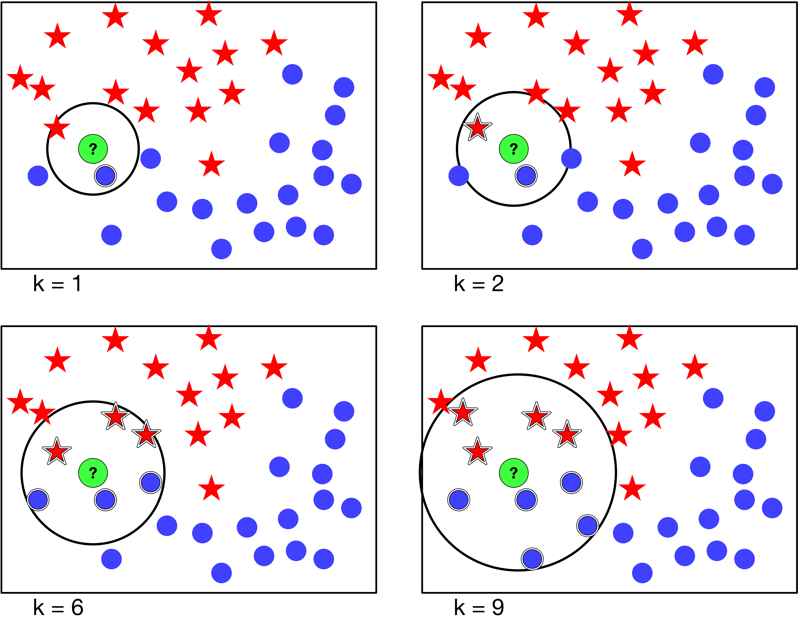

# Otras Técnicas de Clasificación

## Clasificadores basados en reglas

En la sección anterior, el modelo utilizado para clasificar se representaba
como un árbol de decisión. Los clasificadores que veremos a continuación
representan al modelo como conjunto de reglas IF-THEN. Estas reglas son
similares a las condiciones de los nodos de los árboles de decisión, una regla
para clasificar hoteles podría ser:

Regla 1: **IF** *alberca* = *sí* **THEN** *WifiGratis* = *sí*.

Las reglas tienen dos partes:

1. El antecedente o precondición **IF** en la cual hay expresiones
 condicionales sobre los atributos, de manera opcional utilizando operadores
 lógicos, por ejemplo, *alberca* = *sí* OR *estrellas < 5*.

2. El consecuente **THEN** donde se expresa la predicción de la clase o
 categoría a la que pertenece el objeto.

# Ejemplo

Recordemos el ejemplo de los hoteles visto anteriormente:

| id |  hotel    |estrellas|  alberca  | WiFi Gratis |
|----|-----------|--------:|-----------|------------:|
| 1  | Mariots   |   2     | Sí        | Sí          |
| 2  | Díaz Inn  |   2     | No        | Sí          |
| 3  | Mandarina |   5     | Sí        | No          |
| 4  | Le Hotel  |   3     | Sí        | No          |
| 5  | Halton    |   4     | No        | Sí          |
| 6  | Tromp     |   4     | Sí        | No          |

Un modelo basado en reglas para clasificar a los hoteles puede ser:

R1: IF estrellas = 5 OR estrellas = 3 THEN WiFiGratis = Sí
R2: IF alberca = No THEN WiFiGratis = Sí
R3: IF alberca = Sí THEN WiFiGratis = No

Los algoritmos clasificadores basados en reglas extraen las reglas de los datos mediante:

1. La extracción de reglas a partir de árboles de decisión. Las rutas de la
 raíz a las hojas son las precondiciones las hojas son los consecuentes [@han2011data].

2. Se generan las reglas a partir de los datos, utilizando un algoritmo de
 covertura, por ejemplo RIPPER [@cohen1995fast] o CN2 [@clark1989cn2]:

## $k$ vecinos más próximos

Este algoritmo se basa en una idea sencilla: asignar la clase que tengan los
objetos del conjunto de entrenamiento que más se parezcan al objeto a
clasificar. Para calcular la similaridad entre dos objetos, se puede cualcular
simplmente la distancia euclidiana entre los vectores de características de
cada objeto. El parámetro $k$ especifica cuantos objetos (ordenados por
similaridad) se van a considerar para la asignación. En el caso más sencillo se
le asigna al objeto la clase mayoritaria.

El método es muy fácil de implmentar. La selección del valor de $k$ pude
afectar el desempeño del algoritmo. La figura muestra un ejemplo de
clasificación para distintos valores de %k%. Si elegimos un valor de $k$ muy
pequeño puede ser afectado por el ruido o valores atípicos, por otro lado
valores muy grandes se tenderá a considerar un número mayor de datos con otras
clases. El valor del voto que asigna cada objeto puede ponderarse con respecto
a la distancia.

{ width=50% }

## Naïve Bayes

Este clasificador básico recibe el nombre de Naïve que se traduce al español
como ingenuo. La razón de esto es que considera que los valores de los
atributos de un objeto son variables independientes. Es fácil ver que esta
consideración |no siempre es real. Por ejemplo, para los atributos de un hotel:
"número de estrellas" y "alberca" podemos imaginar que un hotel de más de 4
estrellas es muy probable que cuente con una o más. También es muy probable que
un hotel de dos estrellas |no cuente con una. Entonces, un clasificador Naïve
Bayes considera que para una clase $C$ dado un objeto con los 
atributos $\{A_1,A_2,\dots,A_n\}$ podemos calcular la probabilidad condicional:

$P\{C|A_1,A_2,\dots,A_n\}$

Esto significa tratar de estimar las probabilidades a partir del conjunto de
datos de entrenamiento. Para clasificar un registro se debe de calcular la
probabilidad condicional para cada clase $C_j$ y elegir la mayor:

$P\{C_j|A_1,A_2,\dots,A_n\}=\frac{ P\{A_1,A_2,\dots,A_n|C_j\} \cdot P(C_j)}{P\{A_1,A_2,\dots,A_n\}}$

Como solo estamos interesados en elegir la mejor opción basta con calcular:

$P\{A_1,A_2,\dots,A_n|C_j\}\cdot P(C_j)$

Si consideramos (ingenuamente) los atributos como variables independientes, el primer término se simplifica:

$P\{A_1,A_2,\dots,A_n|C_j\} = P\{A_1|C_j\} \cdot P\{A_2|C_j\} \cdot \cdot \cdot P\{A_n|C_j\}$  

#### Ejemplo 

Como ejemplo vamos a utilizar un fragemento del conjunto de datos de [enfermedades agudas](https://archive.ics.uci.edu/ml/datasets/Acute+Inflammations) y utilizaremos un clasificador Naïve Bayes para determinar si un paciente tienen una inflamación aguda de la vejiga.

Datos:

| temp | nausea | dolor lumbar |  necesidad constante | dolor al orinar | comezón en la uretra | infección |
|------|--------|--------------|----------------------|-----------------|----------------------|-----------|
|35.5|no|yes|no|no|no|no|
|36.0|no|yes|no|no|no|no|
|36.8|no|no|yes|yes|yes|yes|
|37.0|no|no|yes|yes|yes|yes|
|37.4|no|no|yes|no|no|yes|
|37.1|no|no|yes|no|no|yes|
|37.6|no|no|yes|yes|no|yes|
|37.8|no|no|yes|yes|yes|yes|
|38.0|no|yes|yes|no|yes|no|
|39.0|no|yes|yes|no|yes|no|
|40.4|yes|yes|no|yes|no|no|
|40.8|no|yes|yes|no|yes|no|
|41.5|yes|yes|no|yes|no|no|
|41.5|no|yes|yes|no|yes|no|

Paciente:

| temp | nausea | dolor lumbar |  necesidad constante | dolor al orinar | comezón en la uretra | infección |
|------|--------|--------------|----------------------|-----------------|----------------------|-----------|
|36.6   |no     |no            |                   yes|              yes|                   yes|        yes|

Como primer paso vamos a calcular $P(C_j)$:

$P(C_j) = \frac{N}{N_c}$

$P('yes') = 6/14 = 0.429$  

$P('no') = 8/14 = 0.571$

Para calcular los atributos discretos:

$P(A_i|C_k) = \frac{|A_ik|}{N_Ck}$

Donde,

* $|A_ik|$ es el número de registros con el atributo $A_ik$ pertenecientes a la clase  $C_k$
* $N_Ck$ es el número de registros pertenecientes a la clase  $C_k$ 

En la siguiente tabla tenemos las probabilidades de los atributos discretos:

| clase | nausea | dolor lumbar |  necesidad constante | dolor al orinar | comezón en la uretra |
|-------|--------|--------------|----------------------|-----------------|----------------------|
|  yes  |0.14    | 0.57         |                  0.71|             0.43|                   0.5|
|  no   |0.86    | 0.43         |                  0.29|             0.57|                   0.5|

Para el caso de datos continuos hay varias opciones @[tan2007introduction]:

* Se discretiza el rango creando particiones y asignando un solo valor a cada una.
* Se hace una división de dos vías a partir de un valor.
* Se estima la densidad de la probabilidad. 
    * Se asume que los valores siguen una distribución normal.
    * Se utilizan los datos para calcular los parámetros de la distribución.
    * Una vez que se conoce la distribución se puede calcular la probabilidad condicional.

En este caso tenemos al atributo temperatura como atributo continuo.

| clase | media  | stdev        | distribución normal x=36.3   |  
|-------|--------|--------------|------------------------------|
|  yes  | 37.28  | 2.38         |     0.16                     |
|  no   | 39.09  | 0.34         |      0                       | 

Incluso antes de multiplicar las probabilidades vemos que en el atributo "temperatura" la clase "no" tiene cero de probabilidad, por lo que la probabilidad de la clase "yes" será mayor. 

$P(Paciente|No) = 0.86 * 0.43 * 0.29 * 0.57 * 0.5 * 0.16 = 0.0048$

$P(Paciente|Yes) = 0.14 * 0.57 * 0.71 * 0.43 * 0.5 * 0 = 0$

$P(Paciente|No)P(No)= 0.0027$

$P(Paciente|Yes)P(Yes)=0$ 

Como P(Paciente|No)P(No) es mayor, **la clase para el registro Paciente es "yes"**

## Redes Neuronales Artificiales

## Support Vector Machines

## Métodos Ensamble