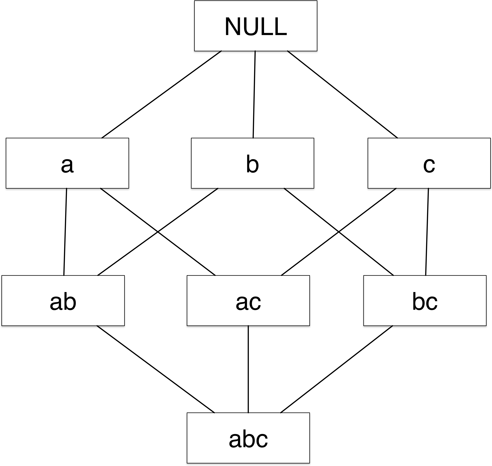
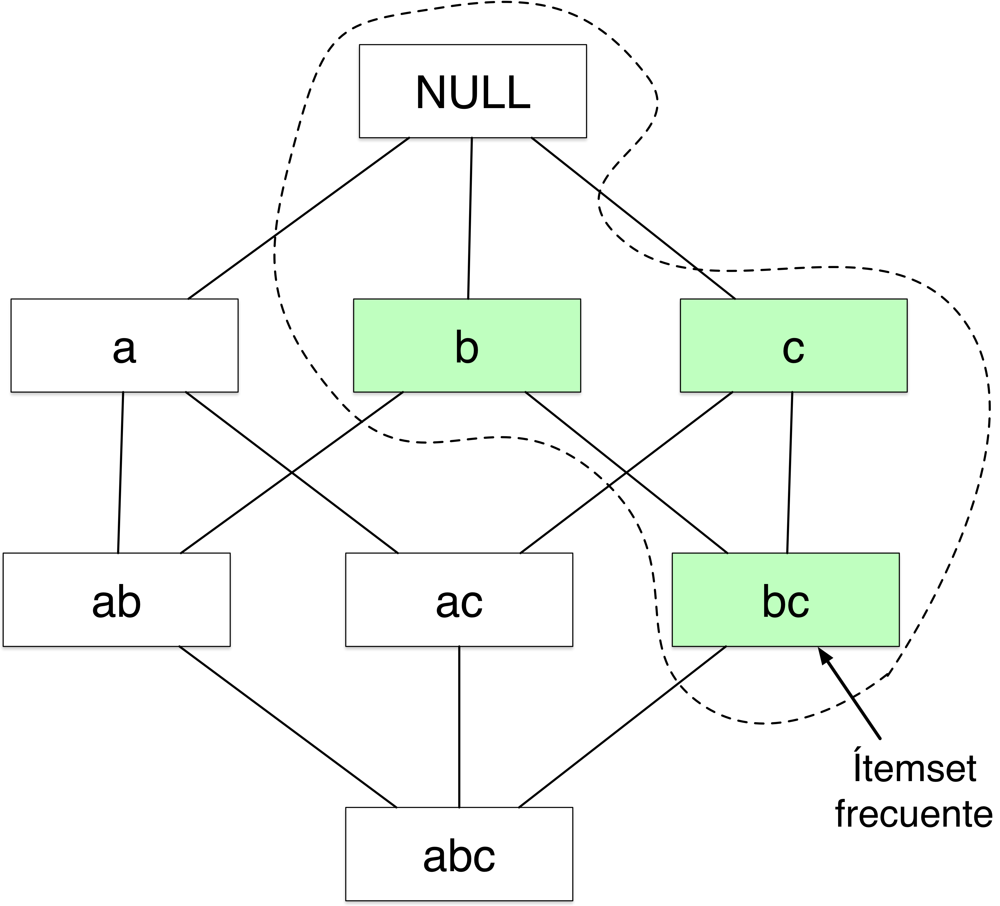
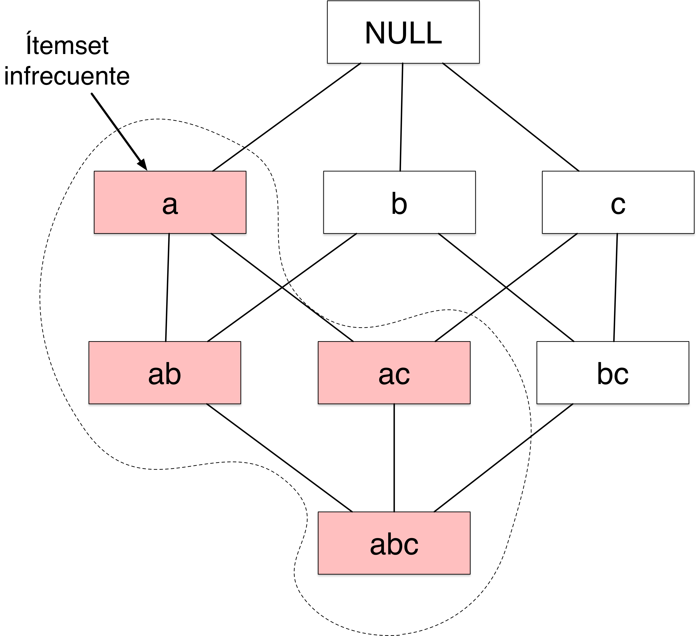
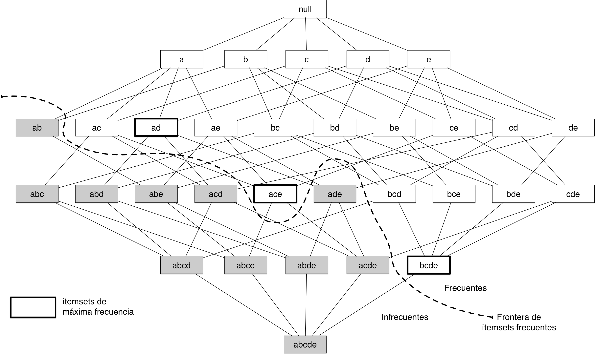
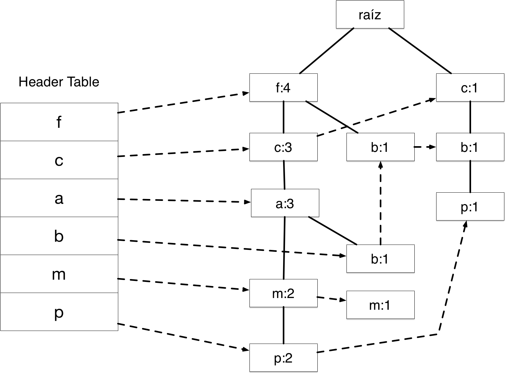

# Análisis de Asociaciones

La tarea de la minería de datos es extraer de manera eficiente patrones útiles
de grandes bases de datos. La extracción de reglas de asociación surge con el
fin descubrir patrones de compra interesantes minando las transacciones de
compra en tiendas al menudeo [@hilderman1999knowledge]. Debido a su principal
aplicación también se le conoce como *Market Basket Analysis* y fue propuesta
inicialmente en [@agrawal1993mining]. Las reglas que se extraen tienen que ver con los articulos que se compran en una transacción y tienen una forma de implicación, por ejemplo:

$\{Skittles, Donas \} \implies \{ Diet Coke \}$ 

La regla sugiere que las personas que compran *Skittles* y Donas también
compran *Diet Coke*. Las reglas incluyen un porcentaje de transacciones que
cumplen con ella. Este conocimiento puede ser utilizado por los empresarios
para la toma de decisiones. Por ejemplo, surtir más un producto, hacer
promociones o ver el impacto que tendría descontinuar algún articulo.

## Definición formal del problema

El problema se ha definido formalmente por @agrawal1993mining: Sea $I = \{i_1,
i_2,\dots,i_m\}$ un conjunto de $m$ atributos binarios a los que llamaremos
*ítems*. Sea $T=\{t_1,t_2,\dots, t_m \}$ un conjunto de $m$ transacciones al
que llamaremos *database*. Cada transacción $t$ es representada por un vector
binario, donde $t[k] = 1$ si en la transacción se compró el ítem $i_k$ en caso
contrario $t[k] = 0$. Sea $X$ un conjunto de ítems en $I$. Decimos que que la
transacción $t$ *satisface* a $X$, si para todos los ítems $I_k$ en $X$, se
cumple que $t[k] = 1$, es decir se compraron todos los ítems $X$. Una *regla de
asociación* se define como una implicación $X \implies I_j$. Como podemos ver
originalmente se consideraba en el consecuente solo un ítem, actualmente se
considera a un conjunto de ítems. Los conjuntos $X$ e $I$ no tienen ítems en
común y a ambos se les denomina *itemsets*, conjuntos de ítems.

También se definen dos restricciones que deben cumplir las reglas, el soporte y
la confianza.

* **Soporte** el soporte indica la frecuencia en la que las transacciones $T$
 incluyen a cierto ítemset. 

 $\mathrm{supp}(X) = \frac{|\{t \in T; X \subseteq t\}|}{|T|}$

* **Confianza** indica que tan frecuentemente se cumple cierta regla $X \implies I$ en $T$

$\mathrm{conf}(X \Rightarrow I) = \mathrm{supp}(X \cup I) / \mathrm{supp}(I)$

Estas restricciones tienen como objetivo el filtrar aquellas reglas que no sean interesantes o que sean poco comunes. El soporte y la confianza se proporcionan al algoritmo como un umbrales mínimos que deben cumplir las reglas que resulten de la búsqueda.

El proceso de minado de reglas puede resumirse en dos pasos:

1. Encontrar todos los conjuntos de artículos que tengan la frecuencia mínima indicada por el umbral    de soporte.

2. A partir de los conjuntos de artículos encontrados en el primer paso, se generan reglas que cumplan  con la restricción de confianza mínima.

Las dos tareas se detallan en las siguientes secciones.

## Generación de conjuntos de artículos frecuentes

{ width=50% }

Para enumerar todos los posibles ítemsets se emplea una rejilla. Como ejemplo
en la figura se muestra la rejilla para el conjunto de ítems $I = \{a, b,
c,\}$. Al incrementar el número de ítems el número de ítemsets se incrementa
exponencialmente. Evaluar a fuerza bruta el soporte de cada una de las
transacciones en $T$ tiene un costo computacional muy alto ya que se tiene que
comparar cada ítemset candidato con todas las transacciones. La técnica
*Apriori* es utilizada para reducir la complejidad computacional.

### El principio Apriori

Para reducir el número de ítemsets candidatos a evaluar, se utiliza el principio Apriori : 

*Si un ítemset ocurre de manera frecuente, entonces todos sus subconjuntos también son frecuentes* 
Esto se ilustra en la figura, donde suponemos que el ítemset {b, c} es frecuente, también los serán {b} y {c}. 

{ width=50% }

Por otro lado, si el ítemset {a} es infrecuente los super conjuntos también lo
serán. Esto permite eliminar de la rejilla aquellos ítemsets bajo el ítemset
infrecuente. Por ejemplo en la Figura, si hay evidencia de que el ítemset {a}
es infrecuente, también los serán {a, b}, {a, c} y {a, b, c} por lo que no hay
necesidad de evaluarlos. El algoritmo de generación de ítemsets Apriori se
aprovecha de este principio. Se empieza en la raíz de la rejilla evaluando el
soporte de los ítemsets con un solo elemento y solo continúa evaluando los
ítemsets que incluyan solo a los ítems con el soporte necesario.

{ width=50% }

## Generación de reglas

Una vez que tenemos los ítemsets frecuentes, podemos empezar a generar reglas.
Tomemos un itemset $Y$ con $k$ ítems, podríamos generar $2^K - 2$ reglas de
asociación sin considerar aquellas reglas con ítemsets nulos. Para generar una
regla, basta dividir a $Y$ en dos conjuntos no nulos: $X$ y $Y-X$. Obtenemos la
regla $X \implies Y-X$, ahora solo tenemos que evaluar si cumple con la
restricción de confianza mínima.

Para calcular la confianza, no es necesario evaluar en todas las transacciones,
ya que la función de confianza se calcula utilizando el soporte de los ítemsets
y esto ya lo calculamos en el paso anterior.

## Representación compacta de conjuntos de artículos frecuentes

Con el objetivo práctico de reducir el espacio de almacenamiento, se han
propuesto técnicas para representar de una manera compacta a la rejilla de
artículos frecuentes. Veamos una técnica basada en el concepto de artículos
frecuentes máximos. Un ítemset de frecuencia máximo es aquel que en la rejilla
no tiene un superconjunto inmediato superior que también sea frecuente. 

En la figura se presenta una rejilla con tres con ítemsets de frecuencia máximos
$\{a, d\}$, $\{a, c, e\}$, $\{b, c, d, e\}$. Solo con estos ítemsets podemos
derivar los ítemsets frecuentes restantes ya que están incluido (son
subconjuntos) de los mismos.

## El algoritmo FP-Growth

Uno de los algoritmos más utilizados para el minado de reglas de asociación es
el algoritmo FP-Growth [@han2000mining]. El algoritmo aborda el problema de
generación de ítemsets de una manera muy distinta a la estrategia utilizada por
*Apriori*. El algoritmo propone el uso de una estructura compacta llamada
*FP-tree* de donde se extraen directamente los ítemsets frecuentes:

1. El algoritmo empieza haciendo un recorrido de la base de datos de transacciones $Trans$, 
   copiando a una lista $F$ solo los ítems frecuentes con su soporte. Después se ordena $F$ de mayor a menor soporte y al resultado le llamaremos $L$ la lista de ítems frecuentes.

2. Se crea el FP-tree, $T$, insertando el nodo raíz el cual se etiqueta como *null*. 

3. Se recorre de nuevo $Trans$ y para cada transacción se hace lo siguiente:
    1. Se ordenan sus ítemsets de acuerdo al orden especificado en $L$.
    2. A la lista ordenada de ítems se le considera como $[p|P]$, donde $p$ es el primer elemento y $P$ el resto. Hecho esto se llama al método insert_tree($[p|P]$, $T$).
    3. insert_tree($[p|P]$, $T$) hace lo siguiente. Si el árbol $T$ tiene un nodo hijo $N$ con el mismo nombre que $p$, se incrementa el contador de $N$; en caso contrario se crea un nuevo nodo y se la asigna 1 a su contador. El padre de este nuevo nodo será $T$. El nodo también se liga a otros nodos con el mismo nombre por medio de una estructura adicional llamada "node-link".  Si $P$ no está vacío se llama de forma recursiva insert_tree($P$, $N$).   
  
**Ejercicio**

Siguiendo el algoritmo anterior y utilizando la siguiente  base de datos de transacciones, recrea en tu mente los pasos necesarios para crear el árbol de la figura. Ver los detalles en [@han2000mining]:

| Tid| Ítems                   | Ítems frecuentes (ordenados)  |
|----|-------------------------|-------------------------------|
| 1  | f, a, c, d, g, i, m, p  | f, c, a, m, p                 |
| 2  | a, b, c, f, l, m; o     | f, c, a, b, m                 |
| 3  | b, f, h, j, o,          | f, b                          |
| 4  | b, c, k, s, p,          | c, b, p                       |
| 5  | a, f, c, e, l, p, m, n  | f, c, a, m, p                 |

 { width=70% }

Antes de minar la estructura veamos las operaciones que nos permite la estructura:

1. Seguir  el "node_link" (flechas punteadas) desde la "Header Table" cualquier ítem $a_i$ para saber en que ítemsets participa. Por ejemplo, el ítem "p", aparece tres ítemsets, en dos ítemsets iguales {f, c, a, m, p} y en {c, b, p.

2. Siguiendo los valores de soporte desde la raíz podemos ver cuantas veces se ha repetido el ítemset hasta el nodo     deseado. Por ejemplo, {f, c, a} tiene un soporte de 3, ya que al final de la ruta en el árbol el último elemento tiene 3 (a:3).  

El minado se realiza siguiendo una estrategia *bottom-up*.

Por ejemplo, empezando con el ítem $p$, vamos a extraer aquellos ítem sets en los que participa con un soporte de 3.

Primero vemos en que rutas participa. Siguiendo el "node_link": vemos que en
{f, c, a, m, p} y {c, b, p}. Empezamos por revisar el soporte del ítemset
{$p$}, vemos siguiendo el "node_link" que tiene: "p:2" + "p:1" = 3. Por lo
tanto tiene un soporte adecuado, decimos que es un ítemset frecuente. Siguiendo
la primer ruta, ahora revisaremos { m, p}, {a, p}, {c, p} y {f,p }. Es
importante actualizar el soporte de los ítems de la ruta durante el proceso. Ya
que recordemos que no todos los ítemsets registrados más arriba incluyen a $p$.
Debemos actualizar el soporte de todos a 2. Consideremos entonces {f:2, c:2,
a:2, m:2, p:2} y la otra ruta {c:1, b:1, p:1}. Al evaluar {m, e} vemos que el
soporte es 2, por lo que no es frecuente. Solo {c,e} es frecuente ya que
tenemos c:2 + c1, considerando la otra ruta a través del "node-link". Por lo
tanto con el ítem p, solo encontramos dos ítemsets frecuentes: {p} y {c, p}. El
algoritmo seguiría minando ahora con el ítem $m$ y así sucesivamente.

El algoritmo FP-Growth, es un buen ejemplo de el uso de estructuras de datos
para mejorar los algoritmos y atacar los problemas con un nuevo enfoque.
Incluso en algunos casos FP-Growth mejora el desempeño de *Apriori* por varios
órdenes de magnitud.
