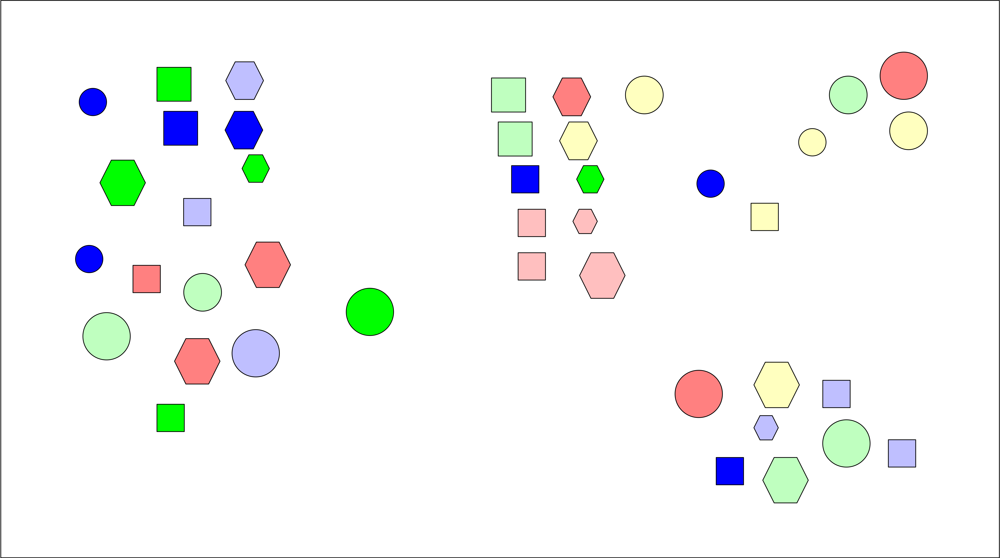
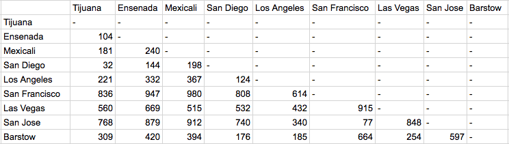
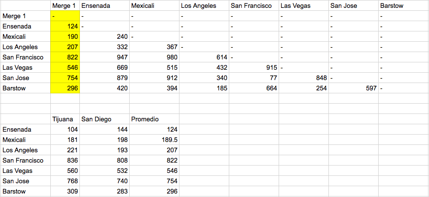
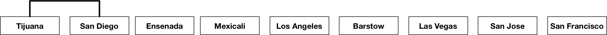
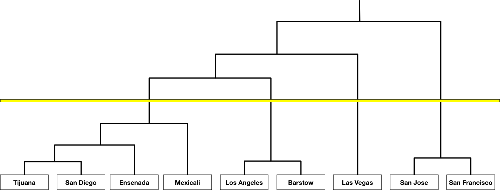
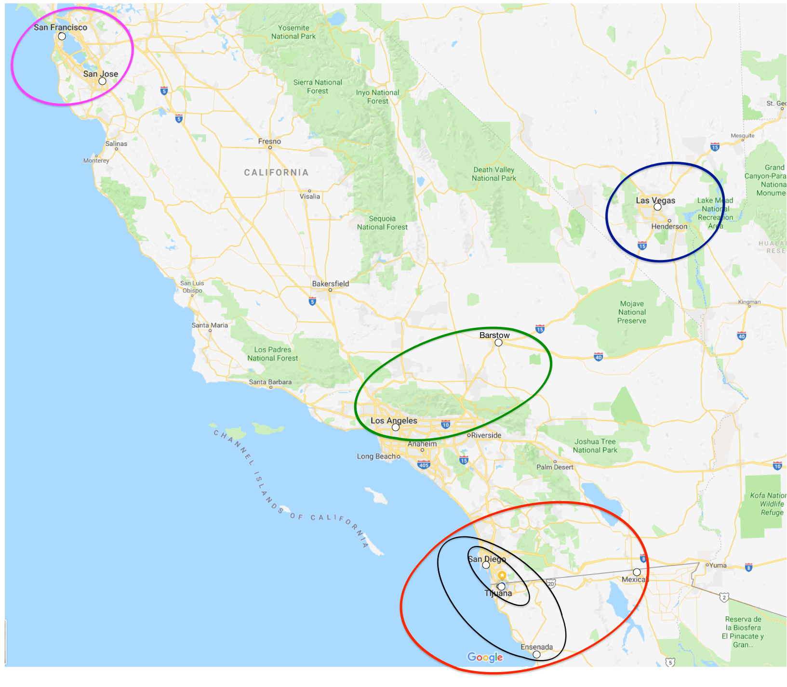
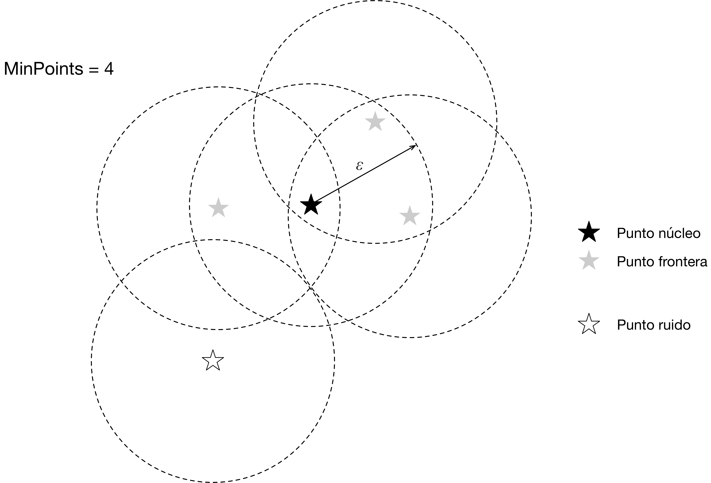

# Análisis de Clusters

El análisis de clusters o grupos, es la tarea de aglutinar conjuntos de objetos
similares (en cierto sentido). Los objetos que pertenecen a un cluster formado
como resultado del análisis, deben ser más similares entre sí que con los
objetos de otros grupos, incluso se desea que la distancia entre los grupos se
lo mayor posible. Es una de las principales tareas de la minería de datos, y el
aprendizaje no supervisado.

Podemos hacer análisis de grupos sin necesidad de programar algoritmos o
utilizar métodos matemáticos ya que el *agrupar objetos* es una de las tareas,
que sin pensar, realizamos todos los días. ¿Como agruparías a los objetos de la
siguiente figura?. Recuerda que se deben agrupar objetos similares. Podemos
agrupar a los objetos, considerando su (a) ubicación, (b) tamaño, (c) color o
algún otro atributo, incluso podemos considerar varias características, por
ejemplo, el color y la figura. En todos estos casos hemos realizado un
*análisis de grupos* sobre las figuras. Una de las preguntas que debemos
hacernos al realizar este tipo de análisis es ¿Cual de las agrupaciones es la
correcta?,para ayudarnos a contestarla se han propuesto varías métricas, pero
mucho depende del contexto de aplicación.

{ width=70% }

{ width=70% }

Si te fijas, esta misma actividad la realizan los científicos para clasificar o
entender distintos fenómenos. Por ejemplo, el estudio de la evolución de las
especies requiere de agrupar animales que tienen características similares. En
la figura siguiente, se muestra un dendograma, donde se agrupan las relaciones
evolutivas entre animales del orden carnívora (imagen del [Instituto de
Biología Canina](https://www.instituteofcaninebiology.org/how-to-read-a-dendrogram.html)),
donde podemos datos interesantes, como que el oso negro es más parecido a una
morsa que a un perro.

](../img/caninebiology.png)

Los métodos matemáticos de análisis de grupos, pueden realizar la misma tarea,
pero en lugar de objetos reales como los animales o figuras, trabajan sobre
datos que representan a los objetos. La representación más común es una matriz
con vectores de datos continuos, categóricos u ordinales. Por ejemplo, las
figuras analizadas anteriormente, pueden ser representadas por la siguiente
matriz:

| id     |  Figura    |Posición  |  Color  | Tamaño      |
|--------|------------|---------:|---------|------------:|
| 1      | Círculo    | 100, 230 | 0000FF  | 50, 50      |
| 2      | Cuadrado   | 430, 450 | CCFFCC  | 70, 70      |
| 3      | Círculo    | 600, 230 | FFFFCC  | 30, 30      |
| 4      | Hexágono   | 300, 330 | 99DDFF  | 30, 30      |
| 5      | Hexágono   | 700, 530 | 0000FF  | 70, 70      |
| 6      | Cuadrado   | 200, 230 | FFFFCC  | 70, 70      |

Los grupos encontrados a partir del análisis de clusters, son potencialmente
*clases o categorías* de objetos: Podemos sugerir que el análisis de grupos es
el descubrimiento de categorías sin necesidad de entrenamiento ya que las
clases pueden extraerse de los datos sin necesidad de que sean asignados
previamente. Cuidado, los algoritmos de análisis de grupos no reemplazan a los
algoritmos de clasificación, ya que las categorías no solo dependen de la
similaridad de ciertas características. Antes de pasar a los algoritmos veamos
primero algunas de las aplicaciones de las técnicas de agrupamiento:

* **Video Juegos** Para los desarrolladores empresas es útil, identificar usuarios con comportamientos similares. Por ejemplo, a partir de capturar el movimiento y actividades de los usuarios, se han identificado tipos de jugadores como: agresivos, cazadores, exploradores,etc. Esta información se utiliza después para hacer cambios en la mecánica del video juego o para dar promociones a otros usuarios.

* **Recuperación de Información** Para mejorar el desempeño de la recuperación de la información, los documentos  
  similares pueden almacenarse cerca unos de otros, mismo servidor, archivo, máquina, etc.

* **Datos Representativos** En lugar de trabajar con todos los datos para realizar algún análisis, se pude trabajar con objetos representatvos de los distintos clusters generados previamente.  
  
* **Cuantificación Vectorial**  A partir de los clusters se pueden obtener vectores característicos. Existen técnicas de compresión como la cuantificación vectorial, que se basan en encontrar vectores característicos para un grupo de objetos similares, así en lugar de almacenar todos los datos de estos objetos, solo se almacena el identificador de su vector característico.

## Clustering basado en prototipos

En este tipo de algoritmo, se tiene un objeto prototipo para cada uno de los grupos. Así la membresía de los objetos a su grupo depende de la similaridad con los prototipos. Para conjuntos de datos continuos, el prototipo es el centroide de todos los objetos que pertenecen al grupo.  

## Clustering basado en densidades

Los grupos se definen como una región de alta densidad rodeada de regiones de baja densidad. 

## Clustering basado en grafos

Los objetos dentro de la estructura de un grafo tienen conexiones intra-grupales pero no conexiones con otros grupos.

## $k$-medias 

El algoritmo de $k$-medias es un algoritmo muy sencillo basado en prototipos.
Solo requerimos especificar el parámetro $k$ donde indicamos el
número de clusters que deseamos obtener. En este algoritmo cada centroide
define a un clúster. El algoritmo es el siguiente: 

1. Se elige de manera aleatoria la posición de los $k$ centroides.

Repetir estos pasos hasta que los centroides no se muevan:

  1. Cada objeto se asigna al centroide más cercano.

  2. Se Recalculan de nuevo los centroides a partir de los objetos que pertenecen a ellos. 

  3. Detener si ninguno cambia de posición, de otro modo continuar el ciclo.

Veamos los detalles del algoritmo sobre los datos de la figura x. Podemos
observar que hay tres grupos **bien formados**, designados como círculos,
rectángulos y hexágonos. Al inicio se posicionan los tres centroides, indicados
por el ícono de lugar (). El siguiente paso es calcular la distancia o
similaridad entre los objetos y los centroides. En este caso utilizamos la
distancia euclidiana, ésta es muy común ya que es fácil de interpretar y
Digamos que para cada objeto se calcula la distancia con cada centroide y se
asigna al centroide más cercano, en este caso aquí lo indicamos con el color.
Antes de iniciar la siguiente iteración se vuelven a calcular los centroides y
como su posición cambió se inicia la iteración siguiente. En la figura podemos
ver como después de cinco iteraciones y se ven pintados correctamente los
grupos.

### Incorrecta selección de las posiciones iniciales de los centroides

Debemos tener cuidado al ejecutar el algoritmo ya que
la ubicación inicial aleatoria pude tener un efecto adverso. Como ejemplo,
veamos el posicionamiento sugerido en la figua 2. Como vemos los clusters
generados no son buenos ya que claramente vemos que en lugar de dos grupos en
la parte superior debería de ser uno, y en la parte inferior dos en lugar de
uno.

### ¿Como evaluamos la calidad de los clusters generados?

Recordemos que lo que buscamos en minimizar la distancia interna de los miembros de un grupo y
maximizar la distancia entre grupos. Como observamos en el clustering insuficiente de la figura x, en la parte superior hay dos clusters muy juntos y la parte inferior cluster con objetos muy lejanos entre sí. Una métrica muy utilizada es la de Suma del Error Cuadrático o SSE (del inglés Sum of Square Error), esta métrica considera  precisamente la distancia de cada objeto a su centroide como un error, de tal manera que por lo menos eliminamos el problema de la parte inferior ya que al hacer el cálculo seguro dará un error mayor al de la agrupación correcta. La formula es esta:  

$SSE = \sum_{i=1}^k \sum_{x \in C_i} dist(m_i,x)^2$

Donde, 

* $k$ es el número de centroides
* $C_i$ es el conjunto de los miembros del centroide actual
* $x$ es el objeto actual
* $m_i$ es el centroide actual
* $\tt{dist} es la función de distancia (en este caso es el error)$
  
Aunque no hay distancias negativas y por lo tanto no hay errores negativos, se mantiene la costumbre de elevar al cuadrado. También podemos observar que si aumentamos el número de clusters $k$ el error es muy posible que disminuya ya que el error se distribuye. El error que suman dos miembros es probable que sea menor que el que generan 3.

### ¿Como evitamos el error provocado por la inicialización?

* Múltiples ejecuciones
* Inicialmente selecciona un número mayor de $k$ centroides y luego de ellos.
* Utiliza otra clustering jerárquico para determinar los centroides. 

## Agrupamiento Jerárquico

Esta técnica busca crear una jerarquía de agrupamientos y se representa típicamente mediante un dendrograma. La representación nos permite ver como se han ido formado los grupos paso a paso, iniciando con objetos individuales en el primer nivel hasta llegar al nivel más alto que incluye a todos los objetos. A diferencia del algoritmo $k$-medias el cual crea un número determinado de agrupaciones en una agrupación jerarquíca elegimos el nivel de agrupación deseado mediante la selección de un punto de corte en el árbol.

Primero vamos a ver el resultado final de un agrupamiento jerárquico. 

Antes de aplicar el método de agrupamiento debemos tener una matriz de similaridad como la mostrada en la figura anterior. En este ejemplo básico, la similaridad es igual a la distancia que hay por carretera entre las ciudades, según [Google Maps](http:\\maps.google.com). En otros casos la similaridad deberá calcularse y de ser necesario utilizando datos normalizados.

El método de agrupamiento que utilizaremos recibe el nombre de **método de grupo-par sin pesos, utilizando promedios aritméticos**, en inglés se le conoce por su abreviación UPGMA [@sokal1958statistical]. El método genera un dendrograma el cual refleja la estructura de la matriz de similaridad. 

En cada paso se deben seleccionar los dos clusters más similares y combinarlos en uno solo. En caso de empate se selecciona uno de los empatados de manera aleatoria.

En el ejemplo los objetos más similares son Tijuana-San Diego con 28 kilómetros. Estos dos clusters serán reemplazados en la matriz por un cluster al que llamaremos *Merge-1*. Es necesario calcular la distancia entre *Merge-1* y los otros objetos, esto se hace calculando el promedio de las distancias de Tijuana y San Diego a los objetos, ver la Figura. Una vez hecho esto, especificamos la primera conexión en el dendrograma.

Se repite el paso hasta que queden solo dos grupos en la matriz y ambos se atan a la raíz del dendrograma.

En este caso estipulamos un corte para obtener cuatro grupos. El resultado también se puede expresar gráficamante como se muestra en la figura.

Se han hecho varias mejoras al algoritmo UPGMA ya que tiene una complejidad en tiempo de $O(n^3)$ por lo cual no es recomendable para grandes cantidades de datos. 

## DBSCAN

[@ester1996density]