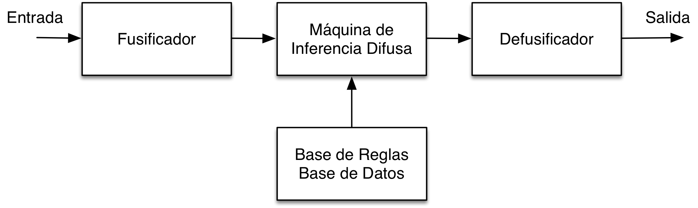

## Regla de Inferencia Composicional

Los sistemas de producción representan el conocimiento en forma de reglas *IF-THEN*, las cuales especifican que acciones se realizarán cuando ciertas condiciones se cumplan, también son conocidos como sistemas basados en reglas. La mayoría de las implementaciones tienen los siguientes componentes principales:

* **Reglas de Producción.** Un conjunto de reglas de producción (también conocidas como reglas \texttt{IF-THEN}) las cuales tienen un estructura de dos partes; el antecedente, conformado por un conjunto de condiciones y el consecuente un conjunto de acciones.

* **Memoria de Trabajo.** Representa el conocimiento actual o hechos los cuales se sabe son ciertos hasta este momento. Estos hechos son evaluados por las condiciones del antecedente de las reglas y las acciones de la parte consecuente modifican sus estado.

* **Máquina de Inferencia.** Este interprete empata las variables de las condiciones en las reglas de producción con los datos o instancias de variables que se encuentran en la \textit{Memoria de Trabajo}, derivando nuevas consecuencias.

La operación básica de estos sistemas se puede describir como un ciclo de tres pasos:

1. Reconocimiento. Se encuentran que reglas se satisfacen en el estado actual de la Memoria de Trabajo. La parte del antecedente de las producciones consiste en un conjunto de cláusulas conectadas por operadores AND, cuando todas estas cláusulas son verdaderas con los datos correspondientes en la Memoria de Trabajo, esta regla tiene oportunidad de disparase.

2. Resolución de Conflictos. Solo una producción puede disparase a la vez, así que cuando dos o mas reglas pueden disparase al mismo tiempo, ocurre un conflicto. En este paso se eligen cuales de las reglas con oportunidad deberán de dispararse.

3. Acciones. Se modifica el estado de la Memoria de Trabajo realizando las acciones especificadas en la parte del consecuente de las reglas seleccionadas en el paso anterior. Los cambios ocurren añadiendo o eliminando elementos de la Memoria de Trabajo.

Este ciclo continúa hasta que no se pueden disparar nuevas reglas de producción. A esta estrategia de control se le conoce como: dirigida por los datos (*data-driven*), ya que cuando el antecedente se satisface, la regla es reconocida; también se le conoce a esta regla como de encadenamiento hacia adelante. En el caso de estrategia de encadenamiento hacia atrás, las metas de la Memoria de Trabajo son emparejadas con consecuentes de las reglas de producción.

Una de las desventajas que se ha reconocido en este tipo de sistemas de reglas, es que en ocasiones algunas reglas no se eligen en el paso de *Reconocimeinto* pues no existe un emparejamiento apropiado en la Memoria de Trabajo. El hecho de que no exista un emparejamiento parcial puede ser una limitante en algunos tipos de sistemas, por que no se desea una terminación prematura del ciclo de inferencia. Una de las formas de tratar esta limitante es utilizando lógica difusa. En la siguiente sección se presenta una de las extensiones a los sistemas de producción que utilizan lógica difusa.

## Razonamiento Difuso

Los Sistemas de Inferencia Difusos (del inglés Fuzzy Inference System) han sido utilizados con éxito en sistemas de control industrial no lineales con numerosas variables de entrada. Una ventaja de este tipo de sistemas es que no requieren de información precisa para trabajar. Estos controladores difusos son un tipo de **Sistema de Producción** donde las reglas modelan un sistema dinámico, dando una relación de entrada salida. A diferencia de los sistemas de producción un FIS no necesita varios ciclos de activación de las reglas pues se tienen dos conjuntos disjuntos de variables de entrada y salida. Como ventaja se tiene que estas reglas se pueden disparar en paralelo [@Konar:2004kx]. 

## Método para el Razonamiento Difuso

Las reglas de producción difusas, utilizan conjuntos difusos para caracterizar las variables y los términos utilizados en las proposiciones de las reglas. Las reglas IF-THEN son expresiones de la forma IF *antecedente* THEN *consecuente*, donde el antecedente es una proposición de la forma $x$ es $A$ donde $x$ es una variable lingüística y $A$ es un término lingüístico. El valor de verdad de esta preposición depende en el grado de emparejamiento entre entre $x$ y $A$. Estas preposiciones pueden estar conectadas por operadores *AND* y *OR* y también pueden ser negados por el operador *NOT*. Dependiendo del tipo de consecuente, se pueden distinguir dos tipos de sistemas de inferencia difusos:

* Modelo difuso lingüístico: donde ambos el antecedente y consecuentes son proposiciones difusas.

* Modelo difuso Takagi-Sugeno* el antecedente es una preposición difusa; el consecuente es una función nítida (*crisp*).

Las variables lingüísticas son variables a las que se le puede asignar términos lingüísticos como valores, por ejemplo: si se define una variable lingüística VELOCIDAD a esta se le puede asignar los términos lingüísticos LENTO, MEDIO o RAPIDO. El significado de estos términos esta definido por sus \textit{funciones de membresía} (MF). Las variables lingüísticas (VL) pueden definirse como la tupla ($v$, $T$, $X$, $g$, $m$), donde $v$ es el nombre de la variable, $X$ es el dominio de $v$, $g$ es una regla sintáctica para generar términos lingüísticos, $m$ es una regla semántica que asigna a cada término $t$ su significado $m$, el cual es un conjunto difuso definido en $X$.

## Sistemas de Inferencia Difusos

Los sistemas de inferencia difusos (FISs) también llamados *Modelos Difusos* son sistemas basados e reglas difusas, que tienen el objetivo de modelar relaciones de entrada-salida. Babuska describe a los FIS como *``funciones matemáticas flexibles las cuales pueden aproximarse a otras funciones o a valores con la precisión deseada''*. Los FIS definen una relación entre variables de entrada y de salida. Las variables de entrada se definen en el antecedente de la regla y las variables de salida en el consecuente. Estos sistemas como se dijo anteriormente, son utilizados en sistemas de control y se componen básicamente de cinco módulos, ver Figura:

1. Base de Reglas. El conjunto de reglas difusas.
2. Base de Datos. Donde se definen las funciones de membresía.
3. Máquina de Inferencia Difusa. Este modulo ejecuta las operaciones de inferencia difusa.
4. Fusificador. Este modulo transforma las entradas del sistema (valores numéricos) en valores lingüísticos.
5. Defusificador. Transforma los resultados difusas a valores numéricos.

Usualmente se le llama *Base de Conocimiento* a la Base de Reglas y Base de Datos en conjunto. Esta Base de Conocimiento es distinta a la Memoria de Trabajo, por que las variables de salida no pueden ser variables de entrada, por lo que el proceso de inferencia es acíclico. Los pasos involucrados en la inferencia difusa de un FIS son:

1. Comparar las variables de entrada con las funciones de membresía en el antecedente, para obtener los valores de membresía de cada término lingüístico. A este paso se le llama también fusificación.
2. Componer a través de un operador T-Norm específico (normalmente max-min o max-producto) los valores de membresía para obtener el grado de soporte de cada regla.
3. Generar la consecuencia calificada para cada regla dependiendo de los grados de soporte. Estas salidas son después agregadas para formar un salida unificada.
4. Finalmente el conjunto difuso de salida es resuelto o defusificado a un valor nítido.

A continuación se describen los tres principales tipos de sistemas de inferencia difusos:

* Tsakumoto. La salida es el promedio de los grados de soporte de cada regla. Las funciones de membresía utilizadas en este método deben ser monotónicas no decrecientes. 

* Mamdani. La salida es calculada aplicando el operador min-max a la salida difusa, cada una igual al mínimo grado de soporte y la función de membresía de la regla. Se han propuesto diferentes esquemas para elegir una  salida nítida basada en la salida difusa; estas incluyen al método del centroide, bisección de área, promedio máximo y criterio máximo. 

* Sugeno. La salida de cada regla es una combinación lineal de las variables de entrada mas un término constante, y la salida es el promedio del grado de soporte de cada regla. 
